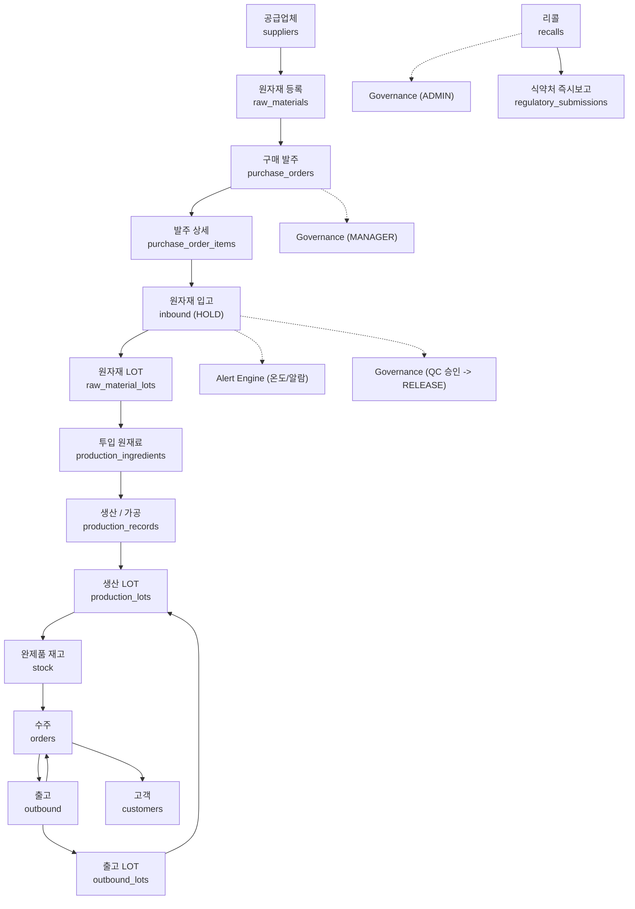

# Mulino Coreano — 추적 흐름도

> Mulino Bianco KR 가상 ERP 추적 흐름도  
> 기준: 한국 식품위생법 / 식품이력추적관리법 / 국세청 전자세금계산서

## 전체 흐름

| 단계 | 프로세스 | 중심 테이블 |
| ---- | -------- | ----------- |
| 1 | 공급업체 관리 | `suppliers`, `supplier_certifications` |
| 2 | 원자재 등록 | `raw_materials`, `raw_material_allergens`, `allergens` |
| 3 | 구매 발주 | `purchase_orders`, `purchase_order_items`, `governance_actions` |
| 4 | 원자재 입고 | `inbound`, `inbound_temperature_logs`, `alert_events`, `raw_material_lots` |
| 5 | 창고 보관 | `warehouses`, `warehouse_temperature_logs`, `alert_events`, `raw_material_lots` |
| 6 | 생산 / 가공 | `production_records`, `production_ingredients`, `production_lots` |
| 7 | 완제품 재고 등록 | `stock`, `warehouse_temperature_logs` |
| 8 | 수주 | `orders`, `order_items` |
| 9 | 완제품 출고 | `outbound`, `outbound_lots`, `regulatory_submissions` |
| 10 | 리콜 / 당국 대응 | `recalls`, `regulatory_submissions`, `v_retention_deadlines` |

---

## 단계별 상세

### STEP 1 — 공급업체 관리

**데이터 처리**
- 공급업체 기본 정보를 등록한다: `name`, `country`, `contact_*`
- 공급업체 인증서를 등록한다: `supplier_certifications`
  - 인증 유형: HACCP / ISO22000 / FSSC22000 / GMP / ORGANIC / HALAL / KOSHER / TRACEABILITY
  - 관리 항목: 발급기관, 인증번호, 파일 첨부, 유효기간 (`ck_cert_dates CHECK (issue_date <= expiry_date)`)
  - 만료 30일 전 알림 후, 만료 시 입고를 차단한다.

**Procurement Agent**
- 인증서 만료 30일 전을 자동 감지하여 담당자에게 알림을 발송한다.
- 만료가 확정되면 Governance에 입고 차단을 요청한다.

---

### STEP 2 — 원자재 등록

**데이터 처리**
- 원자재 기본 정보를 등록한다: `name`, `unit`, `material_type` (INGREDIENT/PACKAGING/ADDITIVE/CONSUMABLE), `supplier_id`
- 알레르겐을 매핑한다: `raw_material_allergens`
  - 한국 식품위생법 의무 표시 22종(19개 법정 표시의무 군)을 `allergens` 마스터로 관리한다.
  - `is_trace` 여부를 표시하며, 흔적 알레르기도 의무 표시 대상으로 관리한다.
  - 복합 유니크 제약(`uk_raw_material_allergen`)으로 중복 매핑을 방지한다.

**QC Agent**
- 신규 원자재 등록 시 알레르겐 미매핑 여부를 자동 검증한다.

---

### STEP 3 — 구매 발주

**데이터 처리**
- 발주 헤더를 생성한다: `purchase_orders`
  - 기본 필드: `supplier_id`, `order_date`, `expected_delivery_date`
  - 상태 흐름: `DRAFT → ORDERED → PARTIAL → COMPLETED`
  - 생성자: `created_by → users.user_id`
  - 국세청 전자세금계산서: `tax_invoice_number`, `tax_invoice_date`
- 발주 상세를 등록한다: `purchase_order_items`
  - 수량 양수 체크 (`ck_po_item_quantity CHECK (quantity > 0)`)
  - 발주-입고-송장 연결로 3-Way Match를 구현한다.

**Procurement Agent & Governance Engine**
- 발주 생성 API 호출 시 Governance Interceptor가 가로채 `governance_actions`에 `PENDING`으로 등록한다 (MANAGER 승인 대기).
- MANAGER가 승인(`governance_decisions`)하면 발주 상태가 `ORDERED`로 변경되고, `governance_audit_logs`에 실행 이력이 영구 보관된다.

---

### STEP 4 — 원자재 입고

**데이터 처리**
- 원자재 입고를 등록한다: `inbound`
  - 초기 상태는 안전을 위해 무조건 `status = 'HOLD'`로 적재된다.
  - `purchase_order_item_id`로 발주 상세와 연결하여 3-Way Match를 검증한다.
- 운송 온도를 기록한다: `inbound_temperature_logs` (상차/하차 온도, `sensor_id`)
- 품질/온도 알람 평가: `alert_rules` 및 `alert_events`
  - 온도 이탈 발생 시 `alert_events`가 자동 생성된다.
- QC 검사 및 상태 확정:
  - QC 담당자 검사 후 `inbound` 상태를 `RELEASED` 또는 `BLOCKED`로 전환한다.
  - 이때 `status_reason`, `status_decided_by`, `status_decided_at` 메타데이터가 필수 기록된다 (`ck_inbound_status_metadata`).
- 원자재 LOT을 생성한다: `raw_material_lots`
  - `status = 'RELEASED'`인 입고 건에 한해 LOT 생성 및 재고 가용화.

**QC Agent & Governance Engine**
- 입고 온도 이탈 또는 알레르겐/인증서 이상 감지 시 즉시 `inbound` 상태를 `BLOCKED` 처리 요청하고 QC 승인을 대기한다.

---

### STEP 5 — 창고 보관

**데이터 처리**
- 원자재 재고를 `raw_material_lots.remaining_quantity`로 추적한다.
- 창고 온도를 상시 기록한다: `warehouse_temperature_logs` (`sensor_id`, `humidity` 지원)
  - 상온 / 냉장 0~5°C / 냉동 -18°C 이하 기준 이탈 시 `alert_events` 발행.
  - 대용량 IoT 시계열 데이터 최적화를 위해 BRIN 인덱스를 적용한다.

**Supply Chain Agent**
- 유통기한 30일 이내 원자재 LOT을 자동 감지하고 우선 사용(FEFO)을 권고한다.
- `remaining_quantity` 추이를 분석해 재고 소진을 예측하고 Procurement Agent에 재발주를 요청한다.

---

### STEP 6 — 생산 / 가공

**데이터 처리**
- 생산 공정을 기록한다: `production_records`
  - 공정 유형: MIX, HEAT, COOL, PACK
  - `parameters JSONB`로 공정별 세부 압력/온도 메타데이터를 유연하게 수용.
  - `operator_id → users.user_id`로 작업자를 추적한다.
- 투입 원재료 LOT을 기록한다: `production_ingredients`
  - `quantity_used` 기록 및 투입 수량만큼 `raw_material_lots.remaining_quantity` 차감.
- 생산 LOT을 생성한다: `production_lots`
  - `product_type`: 완제품(FINISHED_GOODS), 반제품(SEMI_FINISHED) 지원.
  - 상태: `ACTIVE / QUARANTINE / RECALLED / CONSUMED`.

---

### STEP 7 — 완제품 재고 등록

**데이터 처리**
- 완제품 재고를 등록한다: `stock`
  - 복합 유니크(`uk_stock_product_warehouse`)로 제품-창고별 재고 정합성을 보장한다.

**Supply Chain Agent**
- 완제품 재고 수준을 모니터링하여 안전재고 이하로 떨어지면 생산 계획 알림을 발송한다.

---

### STEP 8 — 수주

**데이터 처리**
- 수주 헤더(`orders`) 및 수주 상세(`order_items`) 등록.
- 전자세금계산서 승인번호 및 발행일 관리.

---

### STEP 9 — 완제품 출고

**데이터 처리**
- 완제품 출고를 처리한다: `outbound`
- 출고 LOT을 연결한다: `outbound_lots`
  - `SUM(outbound_lots.lot_quantity) = outbound.quantity` 정합성 보장.
- 식품이력추적관리법 규제 대응:
  - 출고 완료 후 5일 이내 식약처 이력관리시스템 전송 의무 관리 (`regulatory_submissions` 생성, `due_at = outbound_date + 5 days`).

---

### STEP 10 — 리콜 / 당국 대응

**데이터 처리**
- 리콜을 관리한다: `recalls`
  - `lot_id`(생산 LOT) 또는 `raw_lot_id`(원자재 LOT) 기준으로 영향 범위를 즉시 파악.
  - 상태 흐름: `OPEN → IN_PROGRESS → RESOLVED → CLOSED`.
- 식약처 즉시 보고 및 증빙: `regulatory_submissions`
  - 식약처 보고 공문 및 접수번호(`confirmation_number`), 증빙 URL 보관.
- 법적 보관 의무 관리: `v_retention_deadlines`
  - 소비기한 + 2년간 전자 기록 파기 금지 및 법적 보관 상태(`ACTIVE_HOLD_REQUIRED`) 자동 유지.

**QC Agent & Governance Engine**
- LOT 이상 감지 시 `recalls` Draft 생성 및 ADMIN 승인 요청.
- ADMIN 승인 후 `production_lots.status = 'RECALLED'` 처리 및 식약처 보고 레코드 확정.

---

## 양방향 추적 요약

| 방향 | 목적 | 경로 |
| ---- | ---- | ---- |
| **역추적 (Backward)** | 문제 원인 파악 | `customers → orders → outbound → outbound_lots → production_lots → production_records → production_ingredients → raw_material_lots → inbound → purchase_order_items → purchase_orders → suppliers` |
| **순추적 (Forward)** | 리콜 범위 파악 | `suppliers → purchase_orders → purchase_order_items → inbound → raw_material_lots → production_ingredients → production_records → production_lots → outbound_lots → outbound → orders → customers` |

---

## Governance 승인 매트릭스 & 영속화 매핑

Governance Engine은 모든 액션성 API 호출을 가로채고 불변 감사 로그를 남깁니다. 조회성 Tool Call은 가로채지 않고 즉시 실행합니다.

| 대상 액션 | 승인 역할 | 거버넌스 요청 (`governance_actions`) | 최종 변경 테이블 | 감사 로그 (`governance_audit_logs`) |
|---|---|---|---|---|
| `INSERT purchase_orders` | MANAGER | `action_type = 'CREATE_PO'` | `purchase_orders.status = 'ORDERED'` | PO 생성 전/후 스냅샷 보관 |
| `UPDATE inbound` (차단/보류) | QC | `action_type = 'INBOUND_STATUS'` | `inbound.status = 'RELEASED'/'BLOCKED'` | 상태 변경자/사유 스냅샷 보관 |
| `INSERT recalls` | ADMIN | `action_type = 'CREATE_RECALL'` | `recalls`, `regulatory_submissions` | 리콜 접수 및 식약처 보고 증빙 보관 |
| `UPDATE production_lots.status = 'RECALLED'` | ADMIN | `action_type = 'RECALL_LOT'` | `production_lots.status = 'RECALLED'` | LOT 격리 전/후 스냅샷 보관 |

---

## SAP 모듈 매핑

| 데이터 / 컴포넌트 | SAP 모듈 | 대응 기능 |
| ----------------- | -------- | --------- |
| `suppliers`, `supplier_certifications` | MM | 공급업체 마스터 |
| `purchase_orders`, `purchase_order_items` | MM | 구매오더 (`ME21N`) |
| `inbound`, `raw_material_lots` | MM | 입고처리 (`MIGO`) |
| `warehouses`, `stock` | EWM | 창고관리 |
| `production_records`, `production_lots` | PP | 생산오더 |
| `products` | MM | 자재 마스터 |
| `orders`, `order_items`, `outbound` | SD | 수주오더 (`VA01`) |
| `customers` | SD | 거래처 마스터 |
| `recalls`, `alert_rules`, `alert_events` | QM | 품질알림 및 검사관리 |
| `users` | HCM | 사용자 관리 |
| `governance_*`, `regulatory_submissions` | GRC | 거버넌스, 리스크, 컴플라이언스 |
