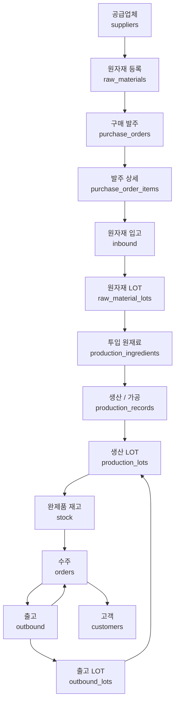

# Mulino Coreano — 추적 흐름도

> Mulino Bianco KR 가상 ERP 추적 흐름도
> 기준: 한국 식품위생법 / 식품이력추적관리법 / 전자세금계산서

## 전체 흐름



| 단계 | 프로세스         | 중심 테이블                                                       |
| ---- | ---------------- | ----------------------------------------------------------------- |
| 1    | 공급업체 관리    | `suppliers`, `supplier_certifications`                            |
| 2    | 원자재 등록      | `raw_materials`, `raw_material_allergens`, `allergens`            |
| 3    | 구매 발주        | `purchase_orders`, `purchase_order_items`                         |
| 4    | 원자재 입고      | `inbound`, `inbound_temperature_logs`, `raw_material_lots`        |
| 5    | 창고 보관        | `warehouses`, `warehouse_temperature_logs`, `raw_material_lots`   |
| 6    | 생산 / 가공      | `production_records`, `production_ingredients`, `production_lots` |
| 7    | 완제품 재고 등록 | `stock`, `warehouse_temperature_logs`                             |
| 8    | 수주             | `orders`, `order_items`                                           |
| 9    | 완제품 출고      | `outbound`, `outbound_lots`                                       |
| 10   | 리콜 / 당국 대응 | `recalls`                                                         |

## 단계별 상세

### STEP 1 — 공급업체 관리

**데이터 처리**

- 공급업체 기본 정보를 등록한다: `name`, `country`, `contact_*`
- 공급업체 인증서를 등록한다: `supplier_certifications`
  - 인증 유형: HACCP / ISO22000 / FSSC22000 / GMP / ORGANIC / HALAL / KOSHER / 이력추적관리등록
  - 관리 항목: 발급기관, 인증번호, 파일 첨부
  - 만료 30일 전 알림 후, 만료 시 입고를 차단한다.

**Procurement Agent**

- 인증서 만료 30일 전을 자동 감지하여 담당자에게 알림을 발송한다.
- 만료가 확정되면 Governance에 입고 차단을 요청한다.

### STEP 2 — 원자재 등록

**데이터 처리**

- 원자재 기본 정보를 등록한다: `name`, `unit`, `supplier_id`
- 알레르겐을 매핑한다: `raw_material_allergens`
  - 한국 식품위생법 의무 표시 22종을 `allergens` 마스터로 관리한다.
  - `is_trace` 여부를 표시하며, 흔적 알레르기도 의무 표시 대상으로 관리한다.

**알레르겐 22종**

밀, 갑각류, 난류, 어류, 땅콩, 대두, 우유, 견과류, 참깨, 아황산류, 조개류, 복숭아, 토마토, 돼지고기, 닭고기, 쇠고기, 오징어, 굴, 전복, 홍합, 잣, 호두

**QC Agent**

- 신규 원자재 등록 시 알레르겐 미매핑 여부를 자동 검증한다.

### STEP 3 — 구매 발주

**데이터 처리**

- 발주 헤더를 생성한다: `purchase_orders`
  - 기본 필드: `supplier_id`, `order_date`, `expected_delivery_date`
  - 상태 흐름: `DRAFT → ORDERED → PARTIAL → COMPLETED`
  - 생성자: `created_by → users.user_id`
  - 전자세금계산서: `tax_invoice_number`, `tax_invoice_date`
    - 한국 B2B 거래는 국세청 전자세금계산서 발급이 의무적이다.
- 발주 상세를 등록한다: `purchase_order_items`
  - 기본 필드: `raw_material_id`, `quantity`, `unit_price`
  - `received_quantity`는 입고 시 누적 업데이트한다.
  - 발주-입고-송장 연결로 3-Way Match를 구현한다.

**Procurement Agent**

- Supply Chain Agent의 재발주 요청을 수신한다.
- 발주 Draft를 자동 생성한다.
- Governance에 MANAGER 승인을 요청한다.

**Governance Engine**

- `INSERT purchase_orders` 호출을 가로챈다.
- MANAGER 승인이 완료되면 실행하고, 미승인이면 차단한다.

### STEP 4 — 원자재 입고

**데이터 처리**

- 원자재 입고를 처리한다: `inbound`
  - `purchase_order_item_id`로 발주 상세와 연결하여 3-Way Match를 완성한다.
  - 기본 필드: `raw_material_id`, `supplier_id`, `warehouse_id`, `quantity`, `inbound_date`, `expiry_date`
- 운송 온도를 기록한다: `inbound_temperature_logs`
  - 상차 시 온도를 측정한다.
  - 하차 시 온도를 측정하며, 기준 이탈 시 입고를 보류한다.
- 원자재 LOT을 생성한다: `raw_material_lots`
  - `lot_number`: 자체 LOT 번호
  - `supplier_lot_number`: 공급업체 LOT 번호 연동
  - `quantity`, `remaining_quantity`, `production_date`, `expiry_date`

**QC Agent**

- 입고 온도 기준 이탈을 감지하면 해당 입고 건을 보류하고 QC 검토를 요청한다.
- 알레르겐 미등록 원자재 입고를 감지하면 입고를 차단하고 담당자에게 알린다.
- 공급업체 인증서 만료 상태에서 입고가 시도되면 Governance에 입고 차단을 요청한다.

**Governance Engine**

- `UPDATE inbound`(차단/보류) 호출을 가로챈다.
- QC 승인이 완료된 후 실행한다.

### STEP 5 — 창고 보관

**데이터 처리**

- 원자재 재고를 `raw_material_lots.remaining_quantity`로 추적한다.
- 창고 온도를 상시 기록한다: `warehouse_temperature_logs`
  - 센서 데이터를 자동 수집한다.
  - 창고 기준: 상온 / 냉장 0~5°C / 냉동 -18°C 이하
  - 설정 기준을 이탈하면 담당자에게 즉시 알림을 발송한다.
  - 대량 데이터가 예상되므로 월별 파티셔닝을 권장한다.

**Supply Chain Agent**

- 유통기한 30일 이내 원자재 LOT을 자동 감지하고 우선 사용을 권고한다.
- `remaining_quantity` 추이를 분석해 재고 소진을 예측한다.
- 지정한 기간 내 소진이 예상되면 Procurement Agent에 재발주를 요청한다.

### STEP 6 — 생산 / 가공

**데이터 처리**

- 생산 공정을 기록한다: `production_records`
  - 공정 유형: 혼합 / 가열 / 냉각 / 포장
  - `operator_id → users.user_id`로 작업자를 추적한다.
  - 기본 필드: `warehouse_id`, `start_time`, `end_time`, `temperature`
- 투입 원재료 LOT을 기록한다: `production_ingredients`
  - 어떤 원자재 LOT이 어떤 생산에 투입되었는지 연결한다.
  - `quantity_used`에 실제 투입량을 기록한다.
  - 투입 수량만큼 `raw_material_lots.remaining_quantity`를 차감한다.
- 생산 LOT을 생성한다: `production_lots`
  - 기본 필드: `lot_number`, `product_id`, `production_date`, `expiry_date`
  - 상태: `ACTIVE / QUARANTINE / RECALLED / CONSUMED`

### STEP 7 — 완제품 재고 등록

**데이터 처리**

- 완제품 재고를 등록한다: `stock`
  - 기본 필드: `product_id`, `warehouse_id`, `quantity`
  - 생산 완료 후 애플리케이션 레벨에서 수량을 증가 처리한다.
- `warehouse_temperature_logs`로 창고 온도를 계속 모니터링한다.

**Supply Chain Agent**

- 완제품 재고 수준을 모니터링한다.
- 안전재고 이하로 떨어지면 생산 계획 알림을 발송한다.

### STEP 8 — 수주

**데이터 처리**

- 수주 헤더를 등록한다: `orders`
  - 기본 필드: `customer_id`, `order_date`, `expected_delivery_date`
  - 상태 흐름: `PENDING → CONFIRMED → SHIPPED → CANCELLED`
  - 생성자: `created_by → users.user_id`
  - 전자세금계산서: `tax_invoice_number`, `tax_invoice_date`
- 수주 상세를 등록한다: `order_items`
  - 기본 필드: `product_id`, `quantity`, `unit_price`

### STEP 9 — 완제품 출고

**데이터 처리**

- 완제품 출고를 처리한다: `outbound`
  - `order_id → orders.order_id`로 수주와 연결한다.
  - 기본 필드: `product_id`, `warehouse_id`, `quantity`, `outbound_date`
- 출고 LOT을 연결한다: `outbound_lots`
  - `outbound_id → outbound.outbound_id`
  - `lot_id → production_lots.production_lot_id`
  - `lot_quantity`로 LOT별 부분 출고 수량을 관리한다.

**정합성 불변 조건**

```sql
SUM(outbound_lots.lot_quantity) = outbound.quantity
```

### STEP 10 — 리콜 / 당국 대응

**데이터 처리**

- 리콜을 관리한다: `recalls`
  - `lot_id`, `raw_lot_id` 기준으로 영향 범위를 즉시 파악한다.
  - 기본 필드: `recall_date`, `reason`, `status`
  - 상태 흐름: `OPEN → IN_PROGRESS → RESOLVED → CLOSED`
- 역추적(Backward Tracing)로 원인을 파악한다.
- 순추적(Forward Tracing)로 리콜 범위를 파악한다.
- 식품의약품안전처에 즉시 보고한다.
- 리콜 관련 이력을 2년간 보관한다.

**QC Agent**

- LOT 이상을 감지하면 `recalls` Draft를 자동 생성한다.
- Governance에 ADMIN 승인을 요청한다.

**Governance Engine**

- `INSERT recalls` 호출을 가로채고 ADMIN 승인 후 확정한다.
- `UPDATE production_lots.status = 'RECALLED'` 호출을 가로채고 ADMIN 승인 후 실행한다.

## 양방향 추적 요약

| 방향   | 목적           | 경로                                                                                                                                                                          |
| ------ | -------------- | ----------------------------------------------------------------------------------------------------------------------------------------------------------------------------- |
| 역추적 | 문제 원인 파악 | `customers → orders → outbound → outbound_lots → production_lots → production_ingredients → raw_material_lots → inbound → purchase_order_items → purchase_orders → suppliers` |
| 순추적 | 리콜 범위 파악 | `suppliers → purchase_orders → purchase_order_items → inbound → raw_material_lots → production_ingredients → production_lots → outbound_lots → outbound → orders → customers` |

## AI 에이전트 개입 시점 요약

| 에이전트           | 단계    | 개입 시점                                                       |
| ------------------ | ------- | --------------------------------------------------------------- |
| Supply Chain Agent | STEP 5  | 유통기한 30일 이내 원자재 LOT 감지 → 우선 사용 권고             |
| Supply Chain Agent | STEP 5  | 재고 소진 예측 → Procurement Agent에 재발주 요청                |
| Supply Chain Agent | STEP 7  | 완제품 안전재고 이하 감지 → 생산 계획 알림                      |
| Procurement Agent  | STEP 1  | 공급업체 인증서 만료 30일 전 감지 → 담당자 알림                 |
| Procurement Agent  | STEP 3  | 재발주 요청 수신 → 발주 Draft 생성 → Governance 승인 요청       |
| Procurement Agent  | STEP 4  | 납품 지연 감지 (`expected_delivery_date` 초과) → 대체 발주 제안 |
| QC Agent           | STEP 2  | 신규 원자재 알레르겐 미매핑 감지                                |
| QC Agent           | STEP 4  | 입고 온도 기준 이탈 감지 → 입고 보류                            |
| QC Agent           | STEP 4  | 알레르겐 미등록 원자재 입고 감지 → 입고 차단                    |
| QC Agent           | STEP 10 | LOT 이상 감지 → `recalls` Draft 생성 → Governance 승인 요청     |

## Governance 승인 매트릭스

Governance Engine은 모든 액션성 API 호출을 가로채고 감사 로그를 남긴다. 조회성 Tool Call은 가로채지 않고 즉시 실행한다.

| 액션                                         | 승인 역할 |
| -------------------------------------------- | --------- |
| `INSERT purchase_orders`                     | MANAGER   |
| `UPDATE inbound`(차단/보류)                  | QC        |
| `INSERT recalls`                             | ADMIN     |
| `UPDATE production_lots.status = 'RECALLED'` | ADMIN     |

## 핵심 불변 조건

| 조건             | 설명                                                                       |
| ---------------- | -------------------------------------------------------------------------- |
| 출고 수량 정합성 | `SUM(outbound_lots.lot_quantity) = outbound.quantity`                      |
| 원자재 소모 추적 | 생산 투입 시 `raw_material_lots.remaining_quantity`를 투입량만큼 차감한다. |
| 양방향 추적 보존 | 스키마 변경 시 역추적/순추적 경로가 끊기지 않아야 한다.                    |

## 한국 법규 준수 체크리스트

| 항목          | 기준                                        |
| ------------- | ------------------------------------------- |
| 알레르기 표시 | 한국 식품위생법 의무 22종 관리              |
| 이력 추적     | 식품이력추적관리법에 따라 2년 보관          |
| 인증서 관리   | HACCP / GMP / 이력추적관리등록 만료 관리    |
| 온도 기록     | 입고 / 창고 / 가공 전 단계 온도 로그        |
| 리콜 대응     | 식품의약품안전처 즉시 보고 체계             |
| 세금계산서    | 전자세금계산서 승인번호 / 발행일 관리       |
| 원산지 표시   | `products.country_of_origin` 관리           |
| 품목 등록     | `products.registration_number`(식약처) 관리 |
| 감사 로그     | Governance Engine 전체 액션 이력 보관       |

## SAP 모듈 매핑

| 데이터 / 컴포넌트                         | SAP 모듈 | 대응 기능               |
| ----------------------------------------- | -------- | ----------------------- |
| `suppliers`, `supplier_certifications`    | MM       | 공급업체 마스터         |
| `purchase_orders`, `purchase_order_items` | MM       | 구매오더 (`ME21N`)      |
| `inbound`, `raw_material_lots`            | MM       | 입고처리 (`MIGO`)       |
| `warehouses`, `stock`                     | EWM      | 창고관리                |
| `production_records`, `production_lots`   | PP       | 생산오더                |
| `products`                                | MM       | 자재 마스터             |
| `orders`, `order_items`, `outbound`       | SD       | 수주오더 (`VA01`)       |
| `customers`                               | SD       | 거래처 마스터           |
| `recalls`                                 | QM       | 품질알림                |
| `users`                                   | HCM      | 사용자 관리             |
| Governance Engine                         | GRC      | 거버넌스 / 컴플라이언스 |
