# MULINO COREANO — ERD

> 본 문서는 `database/ddl/`의 PostgreSQL 스키마를 기준으로 작성된 엔터프라이즈 ERD입니다.
> 거버넌스(L1) 영속화, 품질 모니터링/알람, 식약처 규제 대응 및 비즈니스 확장성(다단계 BOM, 포장재/자재유형, 멀티플랜트)을 반영한 **30개 ERP 코어 테이블**에, 인터페이스 메커니즘(Case/Work Item/대기조건/실행/증거) 지원 **13개 테이블**을 추가해 **총 43개 테이블**을 정의합니다.
> 인터페이스 메커니즘의 개념적 근거는 `docs/08_interface_overview.md`를 따릅니다.
> 스키마 변경 시 이 문서와 `docs/02_flow.md`를 함께 갱신해야 합니다.

---

## 1. 전체 ERD

아래 다이어그램은 **30개 테이블**, **46개 외래키 관계**를 모두 포함합니다.

```mermaid
erDiagram
    users {
        int user_id PK "NOT NULL"
        varchar name "NOT NULL"
        varchar email UK "NOT NULL / UNIQUE"
        varchar password "NOT NULL"
        user_role role "NOT NULL"
        boolean is_active "NOT NULL / DEFAULT TRUE"
        timestamp updated_at "NOT NULL / DEFAULT CURRENT_TIMESTAMP"
        timestamp created_at "NOT NULL / DEFAULT CURRENT_TIMESTAMP"
    }

    suppliers {
        int supplier_id PK "NOT NULL"
        varchar name "NOT NULL"
        varchar country "NOT NULL"
        varchar contact_name "nullable"
        varchar contact_email "nullable"
        varchar contact_phone "nullable"
        timestamp created_at "NOT NULL / DEFAULT CURRENT_TIMESTAMP"
        boolean is_active "NOT NULL / DEFAULT TRUE"
    }

    products {
        int product_id PK "NOT NULL"
        varchar name "NOT NULL"
        varchar sku UK "NOT NULL / UNIQUE"
        varchar unit "NOT NULL"
        int expiry_days "NOT NULL"
        product_type product_type "NOT NULL / DEFAULT FINISHED_GOODS"
        varchar registration_number "nullable / 식약처 품목제조보고번호"
        varchar trace_code "nullable / 식약처 식품이력추적관리 등록번호"
        varchar country_of_origin "nullable"
        jsonb attributes "nullable / 비건, Non-GMO 등 확장 메타데이터"
        boolean is_active "NOT NULL / DEFAULT TRUE"
        timestamp created_at "NOT NULL / DEFAULT CURRENT_TIMESTAMP"
    }

    raw_materials {
        int raw_material_id PK "NOT NULL"
        varchar name "NOT NULL"
        varchar unit "NOT NULL"
        material_type material_type "NOT NULL / DEFAULT INGREDIENT"
        int supplier_id FK "NOT NULL"
        jsonb attributes "nullable / 규격, 보관조건 등 확장 메타데이터"
        timestamp created_at "NOT NULL / DEFAULT CURRENT_TIMESTAMP"
    }

    customers {
        int customer_id PK "NOT NULL"
        varchar name "NOT NULL"
        varchar contact_name "nullable"
        varchar contact_email "nullable"
        varchar contact_phone "nullable"
        varchar address "nullable"
        timestamp created_at "NOT NULL / DEFAULT CURRENT_TIMESTAMP"
    }

    allergens {
        int allergen_id PK "NOT NULL"
        varchar name "NOT NULL"
        varchar code "nullable / 알레르겐 코드"
        varchar legal_category "NOT NULL / 19개 법정 표시의무 군"
        varchar standard "NOT NULL / DEFAULT KR_MFDS"
    }

    warehouses {
        int warehouse_id PK "NOT NULL"
        varchar name "NOT NULL"
        varchar location "nullable"
        warehouse_type type "NOT NULL"
        varchar plant_id "nullable / 공장 및 사업장 식별자"
        int parent_warehouse_id FK "nullable / 구역 및 Zone 계층"
        timestamp created_at "NOT NULL / DEFAULT CURRENT_TIMESTAMP"
    }

    raw_material_allergens {
        int raw_material_allergen_id PK "NOT NULL"
        int raw_material_id FK "NOT NULL"
        int allergen_id FK "NOT NULL"
        boolean is_trace "NOT NULL / DEFAULT FALSE"
    }

    supplier_certifications {
        int supplier_certification_id PK "NOT NULL"
        int supplier_id FK "NOT NULL"
        supplier_certification_cert_type cert_type "NOT NULL"
        varchar cert_number "NOT NULL"
        varchar issued_by "NOT NULL"
        date issue_date "NOT NULL"
        date expiry_date "NOT NULL"
        varchar file_url "nullable"
        timestamp created_at "NOT NULL / DEFAULT CURRENT_TIMESTAMP"
    }

    purchase_orders {
        int purchase_order_id PK "NOT NULL"
        int supplier_id FK "NOT NULL"
        int created_by FK "NOT NULL"
        date order_date "NOT NULL"
        date expected_delivery_date "nullable"
        purchase_order_status status "NOT NULL / DEFAULT DRAFT"
        timestamp created_at "NOT NULL / DEFAULT CURRENT_TIMESTAMP"
        varchar tax_invoice_number "nullable"
        date tax_invoice_date "nullable"
    }

    purchase_order_items {
        int purchase_order_item_id PK "NOT NULL"
        int purchase_order_id FK "NOT NULL"
        int raw_material_id FK "NOT NULL"
        int quantity "NOT NULL"
        decimal unit_price "NOT NULL"
        int received_quantity "NOT NULL / DEFAULT 0"
    }

    inbound {
        int inbound_id PK "NOT NULL"
        int raw_material_id FK "NOT NULL"
        int supplier_id FK "NOT NULL"
        int warehouse_id FK "NOT NULL"
        int purchase_order_item_id FK "NOT NULL"
        int quantity "NOT NULL"
        date inbound_date "NOT NULL"
        date expiry_date "nullable"
        inbound_status status "NOT NULL / DEFAULT HOLD"
        text status_reason "nullable"
        int status_decided_by FK "nullable"
        timestamp status_decided_at "nullable"
        timestamp created_at "NOT NULL / DEFAULT CURRENT_TIMESTAMP"
    }

    inbound_temperature_logs {
        int inbound_temperature_id PK "NOT NULL"
        int inbound_id FK "NOT NULL"
        decimal temperature "NOT NULL"
        varchar sensor_id "nullable"
        timestamp recorded_at "NOT NULL / DEFAULT CURRENT_TIMESTAMP"
        varchar location_note "nullable"
    }

    raw_material_lots {
        int raw_material_lot_id PK "NOT NULL"
        int raw_material_id FK "NOT NULL"
        int inbound_id FK "NOT NULL"
        varchar supplier_lot_number "nullable"
        varchar lot_number UK "NOT NULL / UNIQUE"
        int quantity "NOT NULL"
        int remaining_quantity "NOT NULL"
        date production_date "nullable"
        date expiry_date "nullable"
        timestamp created_at "NOT NULL / DEFAULT CURRENT_TIMESTAMP"
    }

    warehouse_temperature_logs {
        int warehouse_temperature_id PK "NOT NULL"
        int warehouse_id FK "NOT NULL"
        decimal temperature "NOT NULL"
        varchar sensor_id "nullable"
        decimal humidity "nullable"
        timestamp recorded_at "NOT NULL / DEFAULT CURRENT_TIMESTAMP"
    }

    production_lots {
        int production_lot_id PK "NOT NULL"
        int product_id FK "NOT NULL"
        varchar lot_number UK "NOT NULL / UNIQUE"
        date production_date "NOT NULL"
        date expiry_date "NOT NULL"
        int quantity "NOT NULL"
        production_lot_status status "NOT NULL / DEFAULT ACTIVE"
        timestamp created_at "NOT NULL / DEFAULT CURRENT_TIMESTAMP"
    }

    production_records {
        int production_record_id PK "NOT NULL"
        int lot_id FK "NOT NULL"
        int warehouse_id FK "NOT NULL"
        int operator_id FK "NOT NULL"
        production_record_process_type process_type "NOT NULL"
        timestamp start_time "NOT NULL"
        timestamp end_time "nullable"
        decimal temperature "nullable"
        jsonb parameters "nullable / 공정 파라미터 메타데이터"
        text note "nullable"
        timestamp created_at "NOT NULL / DEFAULT CURRENT_TIMESTAMP"
    }

    production_ingredients {
        int production_ingredient_id PK "NOT NULL"
        int production_record_id FK "NOT NULL"
        int raw_material_lot_id FK "NOT NULL"
        int quantity_used "NOT NULL"
    }

    stock {
        int stock_id PK "NOT NULL"
        int product_id FK "NOT NULL"
        int warehouse_id FK "NOT NULL"
        int quantity "NOT NULL"
        timestamp updated_at "NOT NULL / DEFAULT CURRENT_TIMESTAMP"
    }

    orders {
        int order_id PK "NOT NULL"
        int customer_id FK "NOT NULL"
        int created_by FK "NOT NULL"
        date order_date "NOT NULL"
        date expected_delivery_date "nullable"
        timestamp created_at "NOT NULL / DEFAULT CURRENT_TIMESTAMP"
        order_status status "NOT NULL / DEFAULT PENDING"
        varchar tax_invoice_number "nullable"
        date tax_invoice_date "nullable"
    }

    order_items {
        int orders_item_id PK "NOT NULL"
        int order_id FK "NOT NULL"
        int product_id FK "NOT NULL"
        int quantity "NOT NULL"
        decimal unit_price "NOT NULL"
    }

    outbound {
        int outbound_id PK "NOT NULL"
        int product_id FK "NOT NULL"
        int warehouse_id FK "NOT NULL"
        int order_id FK "NOT NULL"
        int quantity "NOT NULL"
        date outbound_date "NOT NULL"
        timestamp created_at "NOT NULL / DEFAULT CURRENT_TIMESTAMP"
    }

    outbound_lots {
        int outbound_lot_id PK "NOT NULL"
        int outbound_id FK "NOT NULL"
        int lot_quantity "NOT NULL"
        int lot_id FK "NOT NULL"
    }

    recalls {
        int recall_id PK "NOT NULL"
        int lot_id FK "nullable"
        int raw_lot_id FK "nullable"
        date recall_date "NOT NULL"
        text reason "nullable"
        recall_status status "NOT NULL / DEFAULT OPEN"
        timestamp created_at "NOT NULL / DEFAULT CURRENT_TIMESTAMP"
    }

    governance_actions {
        bigint governance_action_id PK "NOT NULL"
        int requested_by FK "NOT NULL"
        varchar action_type "NOT NULL"
        varchar resource_type "NOT NULL"
        int resource_id "NOT NULL"
        jsonb payload "NOT NULL"
        int current_step "NOT NULL / DEFAULT 1"
        int total_steps "NOT NULL / DEFAULT 1"
        user_role required_role "NOT NULL"
        varchar priority "NOT NULL / DEFAULT NORMAL"
        governance_action_status status "NOT NULL / DEFAULT PENDING"
        timestamp requested_at "NOT NULL / DEFAULT CURRENT_TIMESTAMP"
        timestamp expires_at "nullable"
    }

    governance_decisions {
        bigint governance_decision_id PK "NOT NULL"
        bigint governance_action_id FK "NOT NULL"
        int decided_by FK "NOT NULL"
        governance_decision_type decision "NOT NULL"
        text reason "NOT NULL"
        timestamp decided_at "NOT NULL / DEFAULT CURRENT_TIMESTAMP"
    }

    governance_audit_logs {
        bigint governance_audit_log_id PK "NOT NULL"
        bigint governance_action_id FK "nullable"
        int actor_id FK "nullable"
        varchar event_type "NOT NULL"
        varchar resource_type "NOT NULL"
        int resource_id "NOT NULL"
        jsonb before_state "nullable"
        jsonb after_state "nullable"
        timestamp occurred_at "NOT NULL / DEFAULT CURRENT_TIMESTAMP"
    }

    alert_rules {
        int alert_rule_id PK "NOT NULL"
        varchar resource_type "NOT NULL"
        varchar rule_name "NOT NULL"
        alert_severity severity "NOT NULL / DEFAULT WARNING"
        jsonb threshold "NOT NULL"
        boolean is_active "NOT NULL / DEFAULT TRUE"
        timestamp effective_from "NOT NULL / DEFAULT CURRENT_TIMESTAMP"
        timestamp effective_to "nullable"
    }

    alert_events {
        bigint alert_event_id PK "NOT NULL"
        int alert_rule_id FK "nullable"
        int inbound_id FK "nullable"
        int warehouse_id FK "nullable"
        varchar sensor_id "nullable"
        varchar alert_type "NOT NULL"
        alert_severity severity "NOT NULL / DEFAULT WARNING"
        jsonb observed_value "NOT NULL"
        timestamp detected_at "NOT NULL / DEFAULT CURRENT_TIMESTAMP"
        timestamp resolved_at "nullable"
    }

    regulatory_submissions {
        bigint regulatory_submission_id PK "NOT NULL"
        regulatory_submission_type submission_type "NOT NULL"
        int recall_id FK "nullable"
        varchar authority "NOT NULL / DEFAULT MFDS"
        timestamp submitted_at "nullable"
        varchar confirmation_number "nullable"
        regulatory_submission_result result "NOT NULL / DEFAULT PENDING"
        timestamp due_at "NOT NULL"
        varchar evidence_url "nullable"
        jsonb metadata "nullable"
    }

    %% Master Relations
    suppliers ||--o{ raw_materials : "공급하는"
    suppliers ||--o{ supplier_certifications : "보유한"
    raw_materials ||--o{ raw_material_allergens : "매핑된"
    allergens ||--o{ raw_material_allergens : "매핑되는"
    warehouses |o--o{ warehouses : "상위구역"

    %% Purchasing & Inbound Chain
    suppliers ||--o{ purchase_orders : "수주하는"
    users ||--o{ purchase_orders : "생성한"
    purchase_orders ||--o{ purchase_order_items : "포함하는"
    raw_materials ||--o{ purchase_order_items : "발주된"
    raw_materials ||--o{ inbound : "입고되는"
    suppliers ||--o{ inbound : "납품하는"
    warehouses ||--o{ inbound : "보관되는"
    purchase_order_items ||--o{ inbound : "실물 수령된"
    users |o--o{ inbound : "품질결정한"
    inbound ||--o{ inbound_temperature_logs : "기록된"
    raw_materials ||--o{ raw_material_lots : "생성된"
    inbound ||--o{ raw_material_lots : "생성된"

    %% Warehousing & Production Chain
    warehouses ||--o{ warehouse_temperature_logs : "기록된"
    products ||--o{ stock : "보관된"
    warehouses ||--o{ stock : "보관된"
    products ||--o{ production_lots : "생산된"
    production_lots ||--o{ production_records : "대상인"
    warehouses ||--o{ production_records : "수행된"
    users ||--o{ production_records : "작업한"
    production_records ||--o{ production_ingredients : "투입된"
    raw_material_lots ||--o{ production_ingredients : "투입되는"

    %% Order & Outbound Chain
    customers ||--o{ orders : "주문한"
    users ||--o{ orders : "생성한"
    orders ||--o{ order_items : "포함하는"
    products ||--o{ order_items : "주문된"
    products ||--o{ outbound : "출고되는"
    warehouses ||--o{ outbound : "출고되는"
    orders ||--o{ outbound : "이행되는"
    outbound ||--o{ outbound_lots : "할당된"
    production_lots ||--o{ outbound_lots : "할당되는"

    %% Quality Recalls & Incidents
    production_lots |o--o{ recalls : "리콜 대상"
    raw_material_lots |o--o{ recalls : "리콜 대상"

    %% L1 Governance Persistence
    users ||--o{ governance_actions : "요청한"
    governance_actions ||--o{ governance_decisions : "결정된"
    users ||--o{ governance_decisions : "결정한"
    governance_actions |o--o{ governance_audit_logs : "감사된"
    users |o--o{ governance_audit_logs : "수행한"

    %% Quality Alert Engine
    alert_rules |o--o{ alert_events : "평가된"
    inbound |o--o{ alert_events : "입고이상"
    warehouses |o--o{ alert_events : "창고이상"

    %% Regulatory Compliance
    recalls |o--o{ regulatory_submissions : "보고된"
```



---

## 2. 양방향 추적 체인 (Traceability Invariants)

```text
순추적 (Forward Tracing)
suppliers
  -> purchase_orders
  -> purchase_order_items
  -> inbound
  -> raw_material_lots
  -> production_ingredients
  -> production_records
  -> production_lots
  -> outbound_lots
  -> outbound
  -> orders
  -> customers

역추적 (Backward Tracing)
customers
  -> orders
  -> outbound
  -> outbound_lots
  -> production_lots
  -> production_records
  -> production_ingredients
  -> raw_material_lots
  -> inbound
  -> purchase_order_items
  -> purchase_orders
  -> suppliers
```

### 핵심 데이터 불변식 (Core Invariants)
1. `SUM(outbound_lots.lot_quantity) = outbound.quantity` (출고 수량 정합성)
2. 생산 투입 시 `raw_material_lots.remaining_quantity` 차감 및 `0 <= remaining_quantity <= quantity` 보장
3. 입고 기본 상태는 `HOLD`이며, `RELEASED`/`BLOCKED` 전환 시 결정자(`status_decided_by`) 및 사유(`status_reason`) 필수 기록
4. 리콜 발생 시 `recalls`에 `lot_id` 또는 `raw_lot_id` 중 최소 1개 이상 필수 지정 (`ck_recalls_target`)
5. 식품이력추적관리법상 `소비기한 + 2년` 동안 추적 체인의 물리 삭제 금지 (소프트 삭제 `is_active` 사용)

---

## 3. ENUM 타입 참조 (28종)

| ENUM 타입 | 값 목록 | 사용 컬럼 |
|---|---|---|
| `user_role` | `ADMIN`, `MANAGER`, `OPERATOR`, `QC`, `VIEWER` | `users.role`, `governance_actions.required_role` |
| `material_type` | `INGREDIENT`, `PACKAGING`, `ADDITIVE`, `CONSUMABLE` | `raw_materials.material_type` |
| `product_type` | `FINISHED_GOODS`, `SEMI_FINISHED`, `INTERMEDIATE` | `products.product_type` |
| `supplier_certification_cert_type` | `HACCP`, `ISO22000`, `FSSC22000`, `GMP`, `ORGANIC`, `HALAL`, `KOSHER`, `TRACEABILITY` | `supplier_certifications.cert_type` |
| `purchase_order_status` | `DRAFT`, `ORDERED`, `PARTIAL`, `COMPLETED` | `purchase_orders.status` |
| `inbound_status` | `HOLD`, `RELEASED`, `BLOCKED` | `inbound.status` |
| `production_record_process_type` | `MIX`, `HEAT`, `COOL`, `PACK` | `production_records.process_type` |
| `production_lot_status` | `ACTIVE`, `QUARANTINE`, `RECALLED`, `CONSUMED` | `production_lots.status` |
| `order_status` | `PENDING`, `CONFIRMED`, `SHIPPED`, `CANCELLED` | `orders.status` |
| `recall_status` | `OPEN`, `IN_PROGRESS`, `RESOLVED`, `CLOSED` | `recalls.status` |
| `warehouse_type` | `AMBIENT`, `CHILLED`, `FROZEN` | `warehouses.type` |
| `governance_action_status` | `PENDING`, `APPROVED`, `BLOCKED`, `EXPIRED` | `governance_actions.status` |
| `governance_decision_type` | `APPROVE`, `BLOCK`, `CANCEL` | `governance_decisions.decision` |
| `regulatory_submission_type` | `RECALL_REPORT`, `TRACEABILITY_TRANSMISSION` | `regulatory_submissions.submission_type` |
| `regulatory_submission_result` | `PENDING`, `ACCEPTED`, `REJECTED` | `regulatory_submissions.result` |
| `alert_severity` | `INFO`, `WARNING`, `CRITICAL` | `alert_rules.severity`, `alert_events.severity` |
| `channel_type` | `CHAT`, `SLACK`, `EMAIL`, `DASHBOARD`, `API` | `channels.channel_type` |
| `intent_type` | `ASK`, `ACT`, `MONITOR` | `cases.intent_type` |
| `case_status` | `OPEN`, `IN_PROGRESS`, `WAITING`, `RESOLVED`, `CLOSED` | `cases.status` |
| `actor_type` | `AGENT`, `USER` | `case_participants.actor_type`, `events.actor_type` |
| `work_item_status` | `READY`, `IN_PROGRESS`, `WAITING`, `BLOCKED`, `DONE`, `CANCELLED` | `work_items.status` |
| `waiting_condition_type` | `SUPPLIER_REPLY`, `EMAIL_SENT`, `APPROVAL`, `SCHEDULED_TIME`, `EXTERNAL_DATA`, `DEPENDENCY_DONE` | `waiting_conditions.condition_type` |
| `waiting_status` | `ACTIVE`, `SATISFIED`, `EXPIRED`, `CANCELLED` | `waiting_conditions.status` |
| `attention_reason_type` | `AUTHORITY_REQUIRED`, `JUDGMENT_REQUIRED`, `MISSING_HUMAN_CONTEXT`, `EXTERNAL_SEND_REQUIRED`, `MATERIAL_EXCEPTION` | `attention_requests.reason_type` |
| `decision_scope` | `THIS_ACTION`, `THIS_CASE`, `THIS_CAMPAIGN`, `THIS_CUSTOMER`, `POLICY` | `decisions.scope`, `attention_requests.suggested_scope/answer_scope` |
| `run_status` | `RUNNING`, `COMPLETED`, `FAILED`, `ABORTED` | `runs.status` |
| `attention_request_status` | `OPEN`, `ANSWERED`, `EXPIRED`, `CANCELLED` | `attention_requests.status` |
| `case_priority` | `LOW`, `MEDIUM`, `HIGH`, `CRITICAL` | `cases.priority`, `work_items.priority` |
| `claim_status` | `ASSERTED`, `VERIFIED`, `CONFLICTED`, `REFUTED` | `claims.status` |

---

## 4. DDL 소스 및 테이블 매핑

| 분류 | 테이블명 | 설명 | 정의 파일 |
|---|---|---|---|
| **마스터 (7)** | `users`, `suppliers`, `products`, `raw_materials`, `customers`, `allergens`, `warehouses` | 기본 기준정보 (자재/제품유형, 19개 법정알레르겐, 플랜트 포함) | `database/ddl/01_master_tables.sql` |
| **관계 (2)** | `raw_material_allergens`, `supplier_certifications` | 다대다 매핑 및 공급업체 인증 관리 (복합 UNIQUE, 날짜 CHECK) | `database/ddl/02_relation_tables.sql` |
| **트랜잭션 (15)** | `purchase_orders`, `purchase_order_items`, `inbound`, `inbound_temperature_logs`, `raw_material_lots`, `warehouse_temperature_logs`, `production_lots`, `production_records`, `production_ingredients`, `stock`, `orders`, `order_items`, `outbound`, `outbound_lots`, `recalls` | 구매-입고-생산-재고-출고-리콜 전 프로세스 트랜잭션 | `database/ddl/03_transaction_tables.sql` |
| **거버넌스 (3)** | `governance_actions`, `governance_decisions`, `governance_audit_logs` | L1 액션 인터셉트, 다단계 승인 의사결정 및 불변 감사 로그 | `database/ddl/03_transaction_tables.sql` |
| **품질/알람 (2)** | `alert_rules`, `alert_events` | 동적 품질/온도 임계치 규칙 및 IoT 센서 알람 이벤트 | `database/ddl/03_transaction_tables.sql` |
| **규제/컴플라이언스 (1)** | `regulatory_submissions` | 식약처 리콜 즉시보고 및 5일 이력정보 전송 증빙 관리 | `database/ddl/03_transaction_tables.sql` |
| **뷰 (1)** | `v_retention_deadlines` | 식품이력추적관리법(소비기한+2년) 의무 보관 만료일 산출 뷰 | `database/ddl/05_foreign_keys.sql` |
| **인터페이스/조직 (13)** | `channels`, `agents`, `cases`, `case_participants`, `work_items`, `waiting_conditions`, `events`, `runs`, `evidence`, `claims`, `claim_evidence`, `decisions`, `attention_requests` | 인터페이스 메커니즘 지원 — 영속 Case, 다중 배정, 대기조건, 일회용 Run, Claim/Evidence 분리, 인간 주의 요청 | `database/ddl/07_case_management.sql` ~ `09_case_fks.sql` |

---

## 4.5. 인터페이스 메커니즘 보조 스키마 (13개 테이블)

`docs/08_interface_overview.md`의 개념을 영속화하는 스키마입니다. ERP 코어(30개 테이블)를 침범하지 않고 나란히(additive) 추가됩니다.

```mermaid
erDiagram
    channels {
        bigint channel_id PK
        channel_type channel_type "CHAT/SLACK/EMAIL/DASHBOARD/API"
        varchar external_ref "채널 측 스레드 식별자"
    }
    agents {
        bigint agent_id PK
        varchar agent_key UK "ORCHESTRATOR/PROCUREMENT/..."
    }
    cases {
        bigint case_id PK
        varchar case_ref UK "CASE-1842"
        text objective
        case_status status
        intent_type intent_type
    }
    case_participants {
        bigint case_participant_id PK
        bigint case_id FK
        actor_type actor_type "AGENT XOR USER"
    }
    work_items {
        bigint work_item_id PK
        varchar work_item_ref UK "WI-102"
        bigint case_id FK
        work_item_status status "READY/IN_PROGRESS/WAITING/..."
    }
    waiting_conditions {
        bigint waiting_condition_id PK
        bigint work_item_id FK
        waiting_condition_type condition_type
        bigint resolved_by_event_id FK "대기를 깨운 이벤트"
    }
    events {
        bigint event_id PK
        varchar event_type "EMAIL_SENT/SUPPLIER_EMAIL_RECEIVED/..."
    }
    runs {
        bigint run_id PK
        varchar run_ref UK "RUN-9182"
        bigint agent_id FK "논리 에이전트"
        jsonb context_snapshot "Context Package 색인 스냅샷"
    }
    evidence {
        bigint evidence_id PK
        varchar evidence_ref UK "EV-122"
    }
    claims {
        bigint claim_id PK
        claim_status status "ASSERTED/VERIFIED/CONFLICTED/REFUTED"
    }
    claim_evidence {
        bigint claim_id FK
        bigint evidence_id FK
        varchar relation "SUPPORTS/REFUTES"
    }
    decisions {
        bigint decision_id PK
        decision_scope scope "THIS_ACTION...POLICY"
    }
    attention_requests {
        bigint attention_request_id PK
        attention_reason_type reason_type "5가지 인간 주의 사유"
    }
```



핵심 불변식:
- `case_participants`: `actor_type`에 따라 agent_id / user_id 중 정확히 하나만 NOT NULL (XOR)
- `work_items`: 에이전트와 사용자에게 동시 배정 금지 (`ck_wi_single_assignee`)
- `cases` / `work_items`: RESOLVED/DONE 계열 상태 ⇔ `resolved_at` 존재 동기화
- `waiting_conditions`: ACTIVE ⇔ `resolved_at` NULL. 해소 시 `resolved_by_event_id`가 근거 이벤트를 가리킨다
- ASK/MONITOR 인텐트는 Case를 생성하지 않는다 — **애플리케이션 규칙**이며 DB CHECK로 강제하지 않는다

---

## 5. 법적 의무 보관 기한 산출 뷰 (`v_retention_deadlines`)

식품 등의 이력추적관리기준(식약처 고시)에 따라 완제품 및 원자재 LOT의 소비기한 경과 후 최소 2년간 전자 기록을 보존해야 합니다.

```sql
SELECT 
    entity_type,
    entity_id,
    lot_number,
    consumption_expiry_date,
    retention_due_date,
    retention_status
FROM v_retention_deadlines
WHERE retention_status = 'ACTIVE_HOLD_REQUIRED';
```
