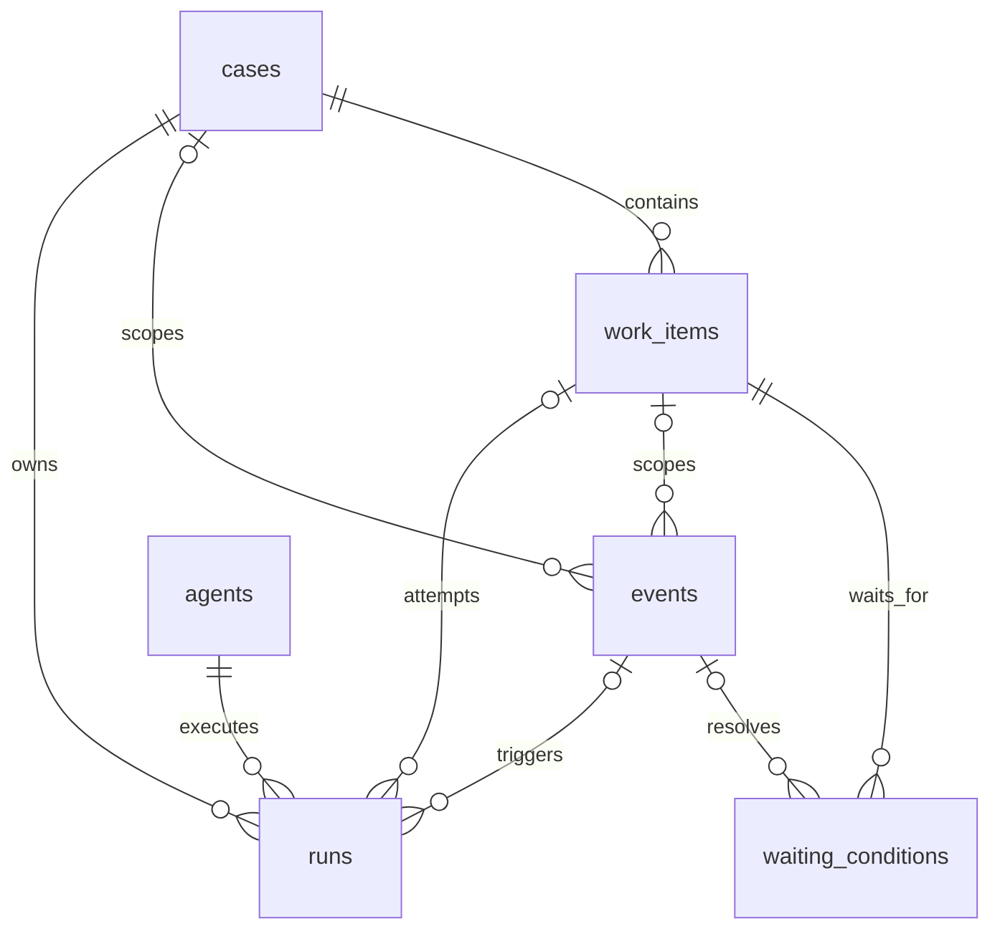
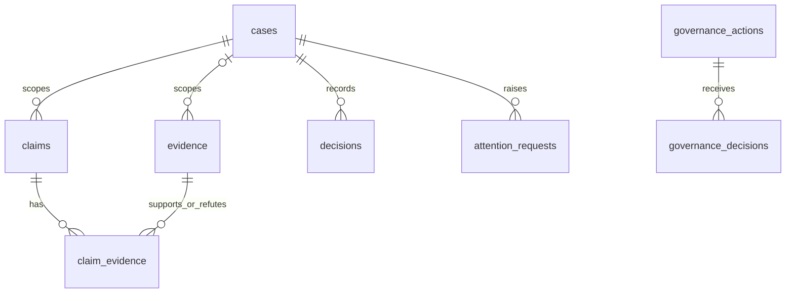

# Case 인터페이스 테이블 계약 검토

이 문서는 현재 `V8`~`V17` migration, Case DDL, 인터페이스 service를 기준으로 Case 업무 표면의 계약을 기록한다. 문서의 현재 상태는 구현된 DB 제약과 service 동작을 구분해 적는다. 후속 설계 제안은 실행 코드, schema 변경, 확정된 정책이 아니다.

## 1. 검토 범위와 현재 결론

Case는 지속되는 업무 목표다. `ASK`는 재고 조회 응답으로 끝나며 Case를 만들지 않고, `ACT` 입력만 Case와 초기 Work Item을 만든다. 아래 그림은 현재 FK 관계다. `||`는 부모가 정확히 하나, `|o`는 부모가 없거나 하나, `o{`는 자식이 0개 이상임을 뜻한다.

구현되어 있는 것은 `POST /cases`의 Case OPEN 및 초기 READY Work Item 생성, `POST /runs`의 READY Work Item 또는 Case 대상 Run 생성, `POST /events`와 `/dispatch`의 대기 해소 및 Run 예약이다. Case 상태 변경, Work Item을 명시적으로 DONE/CANCELLED/WAITING으로 바꾸는 API, Waiting 생성 API, Attention 답변 API, `decisions` 생성 API는 현재 없다. Run의 `RUNNING` 행은 실행 예약/생성 기록이며 실제 LLM 실행과 정상 종료는 후속 실행 계층의 책임이다. 현재도 컨텍스트 재구성 실패는 Run을 FAILED로 기록한다.

여러 ACTIVE 대기 조건은 AND로 처리한다. 각 조건을 SATISFIED로 바꾸되
마지막 ACTIVE 조건이 해소될 때만 WI를 WAITING에서 READY로 바꾸고
Run 생성을 시도한다. 이는 READY에서 IN_PROGRESS로 실행이 시작되거나
업무가 DONE으로 끝났다는 뜻이 아니다. RESOLVED/CLOSED Case와
DONE/CANCELLED WI를 디스패처가 다시 실행하지 않는 보호도 별도로 존재한다.

| 객체 | DB가 허용하는 상태 | #18의 쓰기 경로 |
|---|---|---|
| Case | OPEN / IN_PROGRESS / WAITING / RESOLVED / CLOSED | OPEN 생성. 상태 변경 API는 없음 |
| Work Item | READY / IN_PROGRESS / WAITING / BLOCKED / DONE / CANCELLED | 초기 READY 생성, 조건 충족 시 WAITING→READY. 실행·완료·재대기는 후속 범위 |
| Waiting | ACTIVE / SATISFIED / EXPIRED / CANCELLED | 기존 ACTIVE 조건을 SATISFIED로 변경. 생성·만료·취소 API는 없음 |
| Event | 상태 컬럼 없음 | 사실을 INSERT. 수정·삭제는 DB trigger가 거부 |
| Run | RUNNING / COMPLETED / FAILED / ABORTED | RUNNING 생성, 컨텍스트 재구성 실패 시 FAILED. 정상 완료·중단 API는 없음 |

`claims`와 `evidence`의 생성 API도 현재 없다. 다만 이미 존재하는 Event payload 처리 경로는 검증된 `claimId`와 `evidenceRef`를 같은 Case인지 확인한 뒤 `claim_evidence`를 INSERT한다. 이는 Claim/Evidence 원본 생성 API가 생겼다는 뜻이 아니며, 연결 관계를 보강하는 현재 동작이다.

## 2. 13개 테이블 계약

다음 표의 “생성/변경 코드”는 #18 기준 현재 repository에서 확인되는 경로다.
유지 판단은 현재 분리 구조의 검토 결과이며, 아직 없는 API의 완료를 뜻하지 않는다.

| 테이블 | 책임 | 현재 생성/변경 코드 | 독립 수명 근거 | 현재 유지 판단 |
|---|---|---|---|---|
| `channels` | 외부 채널과 Case/Event/Evidence의 출처 식별 | `V17` 기본 채널 seed; Case 생성 시 기본 채널 조회 | 채널 thread와 Case가 별도 생명주기를 가짐 | 유지. 현재 Case origin은 nullable |
| `agents` | 논리 에이전트 정체성과 활성 상태 | `V17` Orchestrator seed; Run/배정 조회 | 한 에이전트가 여러 Case/Run에 참여하며 Run과 분리됨 | 유지 |
| `cases` | 영속적인 업무 목표와 종료 상태 | `InterfaceService.createCase()` INSERT; 조회만 별도 제공 | 여러 WI, Event, Run, 근거의 상위 업무 경계 | 유지 |
| `case_participants` | Case의 Agent/User 참여자와 역할 | 현재 전용 API 없음; Case 생성 시 Orchestrator 1건 INSERT | 참여는 WI 담당·Run 실행과 다른 Case 단위 관계 | 유지. `AGENT`/`USER`만 허용 |
| `work_items` | Case 목표를 수행하는 구체적 의무 | Case 생성 시 초기 WI INSERT; Dispatcher가 WAITING→READY; Run 생성은 READY 검증 | 하나의 Case에 병렬 의무가 있고 담당·기한·대기가 독립적으로 변함 | 유지 |
| `waiting_conditions` | WI가 실행을 멈추는 조건과 해소 Event | 생성 API 없음; Dispatcher가 조건을 SATISFIED로 변경 | 한 WI에 여러 조건이 있고 마지막 ACTIVE 조건까지 독립 해소됨 | 유지 |
| `events` | 외부 사실·상태 변화를 append-only로 기록 | `DispatcherService.ingest()` 또는 내부 dispatch Event INSERT | 사실은 수정 대신 새 사실로 보정하며 여러 Case/WI에 영향 가능 | 유지. immutable 계약 필수 |
| `runs` | 일회성 실행 시도와 context snapshot 기록 | `RunService.createRun()/tryCreateRun()` INSERT; snapshot/status 변경 | 같은 WI가 여러 실행 시도를 가질 수 있고 실행은 Case 연속성의 저장소가 아님 | 유지 |
| `evidence` | 외부 원본·관측과 출처 보존 | 생성 API 없음; ContextSnapshot은 조회 | 한 근거가 여러 Claim을 지지/반박할 수 있고 Case 연결이 선택적임 | 유지. 원자료의 존재가 내용의 진실성을 보장하지 않음 |
| `claims` | 근거에 대한 추론/제안과 검증 상태 | 생성 API 없음; snapshot 조회; Event가 대상 Claim을 검증 | Claim은 원본 Evidence와 별도 상태(`ASSERTED` 등)를 가짐 | 유지 |
| `claim_evidence` | Claim과 Evidence의 SUPPORTS/REFUTES 연결 | `DispatcherService.linkClaimEvidence()` INSERT, 중복 시 no-op | 연결 자체가 다대다이고 Claim/Evidence와 수명이 다름 | 유지 |
| `decisions` | Case 안의 인간 업무판단 기록 | 생성 API 없음; snapshot 조회 | 업무판단은 Case/WI 문맥과 scope를 가짐 | 당장 제거하지 않되 답변과의 중복·승인 경계는 §5와 #45에서 재검토 |
| `attention_requests` | 인간에게 질문·주의를 요청하고 답변 상태를 기록 | 생성 API 없음; Dispatcher가 미배정/실패 attention INSERT; 현재 답변 경로 없음 | 질문은 업무 실행과 별도 수명이며 OPEN/ANSWERED 등 상태가 있음 | 유지. 답변 중복 계약을 후속 설계해야 함 |

`V16`은 참여자 중복을 `(case_id, actor_type, agent_id, user_id)`로 막고, Decision/Attention의 WI가 같은 Case인지 composite FK로 확인한다. `V17`은 필수 논리 소유자인 Orchestrator와 기본 채널만 seed하며 기존 비활성 Agent를 자동 활성화하지 않는다.

## 3. 관계와 optionality

DB FK의 nullable 여부를 기준으로 관계를 읽어야 한다. 단순히 모든 Event를 Case에 귀속시키거나 모든 Evidence에 Case를 요구하면 현재 설계와 맞지 않는다.

| 자식 → 부모 | FK 상태 | 현재 의미/cardinality |
|---|---|---|
| `cases.origin_channel_id → channels` | nullable | Channel 0..1 : Case 0..N. API 생성 경로는 기본 채널을 붙이지만 DB 계약상 Case origin은 선택적임 |
| `case_participants.case_id → cases` | NOT NULL | Case 0..N participants. `actor_type`은 정확히 `AGENT` 또는 `USER`; 해당 actor FK 하나만 채워야 함 |
| `work_items.case_id → cases` | NOT NULL | Case 1 : WI 0..N. 담당 Agent/User는 각각 nullable이며 둘 다 없을 수 있고 동시에 둘일 수 없음 |
| `waiting_conditions.work_item_id → work_items` | NOT NULL | WI 1 : Waiting 0..N. 여러 ACTIVE 조건은 최소 구현에서 AND로 해석됨 |
| `events.case_id → cases` | nullable | 전역 Event를 허용함. WI가 있으면 `case_id`도 필수이며 composite FK가 같은 Case임을 보장함 |
| `events.channel_id/agent_id/user_id` | 모두 nullable | 출처 actor/channel이 없는 내부·전역 Event를 허용함. Event actor 조합 자체의 완전성은 DB check가 아니라 현재 service 승인 경로가 주로 보장함 |
| `runs.case_id → cases` | NOT NULL | Case 1 : Run 0..N. `work_item_id`는 nullable이어서 Case 대상 Run을 허용하며, 있으면 composite FK로 같은 Case에 속해야 함 |
| `runs.trigger_event_id → events` | nullable | 직접 원인이 없는 Run도 허용; Dispatcher 경유 Run은 trigger를 기록함 |
| `runs.agent_id → agents` | NOT NULL | Run마다 논리 Agent 하나를 참조하며 Agent는 여러 Run을 가질 수 있음 |
| `waiting_conditions.resolved_by_event_id → events` | nullable | 조건마다 해소 Event는 0..1개이고 하나의 Event가 여러 조건을 해소할 수 있음 |
| `evidence.case_id → cases` | nullable | Case에 아직 연결되지 않은 원본 Evidence를 허용함. channel/run도 각각 선택적임 |
| `claims.case_id → cases` | NOT NULL | Case 1 : Claim 0..N. 주장 actor는 0 또는 1명이며 run만 출처일 수도 있음 |
| `claim_evidence` | 양쪽 NOT NULL | Claim : Evidence = N : M; `(claim_id,evidence_id,relation)` PK, relation은 SUPPORTS/REFUTES |
| `decisions.case_id → cases` | NOT NULL | Case 1 : Decision 0..N. WI와 source channel은 nullable; WI가 있으면 composite FK로 같은 Case임을 보장함 |
| `attention_requests.case_id → cases` | NOT NULL | Case 1 : Attention 0..N. WI와 요청/답변 actor는 nullable; WI가 있으면 composite FK로 같은 Case임을 보장함 |

기존 `users`는 Case 개설자, 참여자, WI 담당자, Event/Claim 작성자,
Decision 결정자와 Attention 응답자로 연결된다. `decisions.decided_by_user_id`만
이들 독립 컬럼 중 NOT NULL이며, participant는 actor 종류에 따라 User 또는
Agent 하나가 필수다. Evidence의 수집 Run, Claim의 작성 Run, 출처 Channel은
각각 0..1개이고 부모마다 여러 기록이 연결될 수 있다. 이 FK들은 원본의 존재를
보장하지만 수집/작성 Run과 근거의 Case 일치까지 보장하지는 않는다.

보조 관계는 다음처럼 요약된다.

## 4. DB가 보장하는 것과 service가 보장하는 것

### DB가 직접 보장하는 것

- Case/WI/Waiting의 resolved timestamp와 상태 조합, Claim의 resolved 상태 조합을 check constraint로 보장한다. 특히 `ck_waiting_resolved`는 `status='ACTIVE'`일 때 `resolved_at IS NULL`이고 그 외 상태일 때 `resolved_at IS NOT NULL`인지만 검사한다. 해소 Event의 존재, `resolved_by_event_id`의 필수성, Work Item의 WAITING 상태는 이 constraint가 보장하지 않는다.
- WI는 Agent와 User를 동시에 담당할 수 없고, 미배정도 허용한다. `assigned_agent_id` 또는 `assigned_user_id` 중 하나만 있을 수 있다.
- Case participant는 `AGENT`/`USER` 두 종류만 허용하며, actor 종류에 맞는 FK 하나만 채운다.
- Event는 `UPDATE`, `DELETE`, `TRUNCATE` trigger로 수정·삭제할 수 없다. 중복 외부 키는 `(event_type, external_ref)` unique로 제한한다. 내부 Event는 nullable `external_ref`를 사용할 수 있다.
- Event에 WI가 있으면 Case도 있어야 하고, `(work_item_id, case_id)` composite FK로 Case가 일치해야 한다. 같은 규칙이 Run/Decision/Attention에도 적용된다.
- 실행 중인 WI에는 partial unique index로 `RUNNING` Run을 최대 하나만 둘 수 있다.
- `claim_evidence`는 두 부모를 반드시 참조하고 SUPPORTS/REFUTES 외 relation을 거부한다.

### 현재 service가 추가로 검증하는 것

- `InterfaceService`는 `ACT`만 Case 생성으로 허용하고, 기본 채널과 활성 Orchestrator를 조회해 Case와 초기 READY WI를 함께 만든다. DB 자체는 `intent_type='ACT'`만 허용하는 제약을 갖지 않는다.
- `RunService`는 Case가 종료 상태가 아닌지, WI가 READY인지, 요청 Agent가 활성이고 WI의 Agent 배정과 일치하는지, 사용자 배정 WI에는 Agent Run을 만들지 않는지를 확인한다. Case 대상 Run은 WI 없이 허용된다.
- `DispatcherService`는 Event 외부 인입에서 `DISPATCH_REQUESTED`/`DISPATCH_SWEEP_TRIGGERED`를 차단하고 `externalRef`를 요구한다. 대기 조건의 payload 일치, 마지막 ACTIVE 조건 해소, 완료 WI 보호, inactive Agent attention 생성도 service 판정이다.
- Dispatcher는 Event payload의 Claim/Evidence 식별자를 DB에서 해소하고 양쪽 Case가 같은지 확인한 뒤에만 `claim_evidence`를 INSERT한다. FK는 존재성만 보장하고 이 업무 scope 검증은 service가 담당한다.
- Dispatcher의 승인 Event는 `attention_request_id` 또는 `governance_action_id` 중 정확히 하나를 요구한다. Governance 경로는 승인된 `governance_decisions`를 조회하지만, Attention 경로는 `ANSWERED` 행의 `answer_text`가 `APPROVED` 또는 `APPROVE`인지 문자열로 확인한다.

따라서 answered attention의 승인 문자열은 현재 Dispatcher가 후속 Event 매칭에 사용하는 입력 형식일 뿐이다. 해당 문자열만으로 실제 사용자의 governance role, 대상 ERP resource 권한, 인증 주체, 승인 매트릭스 검증이 완료되었다고 해석하면 안 된다. 특히 일반 `decisions`의 `decision_text`나 Attention 답변을 `governance_decisions`의 `APPROVE`와 같은 권한 원장으로 취급하지 않는다.

## 5. Attention, 일반 Decision, Governance Decision의 경계

현재 세 기록의 대상과 소비 경로는 다음과 같다. DDL의 `decisions` 주석은
인간 승인과 재발주 승인을 예로 들어 책임이 완전히 구분됐다고 볼 수 없다.
실제 Dispatcher는 `decisions`를 승인 검증에 사용하지 않는다.
일반 업무판단과 ERP 승인 권한의 명확한 구분은 아래 후속 설계 제안이다.

| 기록 | 의미 | 현재 상태 | 권한 해석 경계 |
|---|---|---|---|
| `attention_requests`의 답변 | 질문에 대한 인간 응답과 적용 scope | 답변 생성 API는 없고, Dispatcher는 이미 저장된 ANSWERED 행을 조회함 | `APPROVED` 문자열은 형식 판정일 뿐 권한 검증 완료가 아님 |
| `decisions` | Case/WI의 인간 결정 및 적용 범위. DDL 예시에는 구매 승인도 포함됨 | 생성 API 없음; snapshot에 표시됨 | 현재 Dispatcher의 승인 검증 원본으로 쓰이지 않음 |
| `governance_actions` + `governance_decisions` | 승인 매트릭스에 따른 ERP action 권한 판단 | Dispatcher는 승인된 `governance_decisions`를 조회할 수 있음. L1 인터셉터/실제 인증 연결은 후속 경계임 | action/resource/required role/결정 주체를 재검증해야 함 |

후속 설계에서는 `AUTHORITY_REQUIRED` Attention을 일반 질문과 분리된 승인 요청으로 취급하고, 답변을 받을 때 인증된 User, 대상 action/resource, 요구 role, 결정 시각, 원본 요청의 immutable fingerprint를 함께 기록하는 방안을 검토한다. 그때도 일반 Decision은 업무판단 기록으로 남기고 governance 권한 판정에 재사용하지 않는다.

현재 답변 기록의 중복 문제 후보는 다음과 같다.

1. `attention_request_id`별 단일 active answer를 별도 answer row로 두고 `(attention_request_id, answer_revision)` 또는 active unique로 이력을 분리한다.
2. 기존 `attention_requests` 행을 단일 답변 source of truth로 유지하되, ANSWERED 전환을 잠금과 version/idempotency key로 한 번만 허용한다.
3. 답변을 Event로만 append하고 Attention은 projection으로 유지한다.

현재 권고는 2번에서 시작하는 것이다. 기존 응답 필드를 원본으로 두고,
단순 정보 답변은 별도의 Decision으로 중복 저장하지 않는다. 지속적인 업무
판단을 남겨야 하는 응답만 원본 Attention과 연결된 Decision으로 기록하는
방향을 검토한다. ERP 승인 결과는 Governance Decision을 원본으로 삼고,
Attention이나 일반 Decision에는 그 결과의 참조를 둔다.

현재 세 테이블 사이에는 이 연결을 강제하는 FK가 없으며, 이는 후속 설계
제안이다. #45에서 단일 답변·정정 정책, 연결 키, 원자성 및 멱등성을 확정한다.
재답변 이력을 독립적으로 조회해야 하는 요구가 확인되면 1번으로 확장할 수 있다.
이 검토만으로 답변 테이블 추가나 기존 컬럼 제거를 확정하지 않는다.

## 6. 근거와 후속 범위

현재 계약의 직접 근거는 다음과 같다.

- [V8 interface types](../backend/src/main/resources/db/migration/V8__interface_types.sql), [V9 Case tables](../backend/src/main/resources/db/migration/V9__case_management.sql), [V10 indexes](../backend/src/main/resources/db/migration/V10__case_indexes.sql), [V11 FKs](../backend/src/main/resources/db/migration/V11__case_fks.sql)
- [V12 event idempotency](../backend/src/main/resources/db/migration/V12__dispatcher_event_idempotency.sql), [V13 active Run uniqueness](../backend/src/main/resources/db/migration/V13__active_run_uniqueness.sql), [V14 event immutability](../backend/src/main/resources/db/migration/V14__event_immutability.sql), [V15 scope hardening](../backend/src/main/resources/db/migration/V15__dispatcher_integrity_hardening.sql), [V16 context integrity](../backend/src/main/resources/db/migration/V16__case_context_integrity.sql), [V17 bootstrap](../backend/src/main/resources/db/migration/V17__interface_bootstrap.sql)
- [transaction and governance tables](../database/ddl/03_transaction_tables.sql), [Case DDL](../database/ddl/07_case_management.sql), [Case indexes](../database/ddl/08_case_indexes.sql), [Case FKs](../database/ddl/09_case_fks.sql)
- [interface overview](08_interface_overview.md), [dispatcher specification](09_dispatcher_spec.md)
- [InterfaceService](../backend/src/main/java/com/mulinocoreano/backend/interfacepackage/InterfaceService.java), [DispatcherService](../backend/src/main/java/com/mulinocoreano/backend/interfacepackage/DispatcherService.java), [RunService](../backend/src/main/java/com/mulinocoreano/backend/interfacepackage/RunService.java), [ContextSnapshotService](../backend/src/main/java/com/mulinocoreano/backend/interfacepackage/ContextSnapshotService.java)

후속 구현의 범위는 답변 API와 인증된 권한 주체의 연결, Case/WI 상태 변경 API의 명시적 계약, claims/evidence 원본 수집 API, governance 인터셉터와 ERP action의 결합, 그리고 답변/Event idempotency 정책이다. 이 문서는 그 범위를 제안하지만 해당 구현이나 schema 변경을 수행하지 않는다.

## 7. 후속 목표의 경계

- [#43 Case 테이블 계약 조사](https://github.com/mulino-coreano/mulino-coreano-erp/issues/43)는 이 문서가 다루는 현재 구조와 계약 검토 목표다.
- [#44 Case 증거·Claim 등록과 검증 이력 구현](https://github.com/mulino-coreano/mulino-coreano-erp/issues/44)은 `evidence`·`claims` 원본 등록과 검증 이력 구현을 다루는 Phase 6 목표다.
- [#45 인간 답변·업무 결정 기록과 ERP 승인 경계 구현](https://github.com/mulino-coreano/mulino-coreano-erp/issues/45)은 인간 답변, 일반 업무 결정, ERP 승인 권한의 경계를 구현하는 Phase 5 목표다.
- 기존 [#33 승인엔진](https://github.com/mulino-coreano/mulino-coreano-erp/issues/33)은 governance 승인 엔진의 별도 범위이고, [#35 실제 UX 검증](https://github.com/mulino-coreano/mulino-coreano-erp/issues/35)은 사용자 승인 경험과 실행 검증의 별도 범위다.
