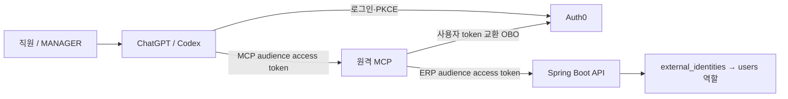

# Auth0 인증과 MCP 연결

이 문서는 재보충 데모의 첫 구현 단계인 인증 연결을 설명한다. Auth0 tenant 구성, 계정 연결, ChatGPT·Codex의 실제 로그인 시험을 완료해야 외부 연결 검증이 끝난다. 로컬 모의 JWT/JWKS 시험은 실제 tenant 로그인 성공을 의미하지 않는다.

## 1. 인증 경로

MCP와 ERP API는 각각 자기 audience의 토큰을 검증한다. MCP는 사용자가 준 ERP 토큰을 요구하거나 MCP용 토큰을 그대로 다른 API에 전달하지 않는다. Auth0 OBO 교환을 통해 원 사용자 신원을 유지한다.

외부 계정의 `(issuer, subject)`는 사전 등록된 ERP 사용자와 연결한다. 이메일 주소 일치나 토큰의 역할 문자열만으로 연결하거나 승격하지 않는다. ERP 사용자의 현재 `is_active`와 `role`을 확인한다.

## 2. 환경 설정

실제 값은 gitignored 로컬 환경 파일 또는 프로세스 환경에 둔다. 예제에 토큰이나 클라이언트 시크릿을 넣어 커밋하지 않는다.

| 변수 | 사용 위치 | 값의 의미 |
|---|---|---|
| `DB_URL`, `DB_USERNAME`, `DB_PASSWORD` | Backend | PostgreSQL 18 연결 |
| `MULINO_AUTH_ISSUER` | Backend / MCP | Auth0 issuer, 예: `https://tenant.example.auth0.com/` |
| `MULINO_API_AUDIENCE` | Backend / MCP | `urn:mulino:erp-api` |
| `MULINO_PUBLIC_ORIGIN` | MCP | 고정 HTTPS origin, 경로 없이 설정 |
| `MULINO_MCP_AUDIENCE` | MCP | 공개 origin + `/mcp` |
| `MULINO_AUTH0_CLIENT_ID`, `MULINO_AUTH0_CLIENT_SECRET` | MCP | MCP가 ERP 토큰을 교환하기 위한 OBO client |
| `MULINO_WORKER_CLIENT_ID` | Backend | 내부 dispatch API를 사용할 유일한 worker M2M client ID |
| `MULINO_API_BASE` | MCP | 기본 `http://localhost:8080/api/v1`, 로컬 내부 연결 |
| `MULINO_API_TOKEN` | stdio MCP | ERP audience의 access token, Backend가 실제 신원·scope·역할 검증 |

OBO client 시크릿과 worker M2M 시크릿은 모델 입력·도구 결과에 전달하지 않는다. worker runtime과 lease별 capability는 후속 단계에서 구현한다. 현재 worker client 설정은 기존 이벤트·디스패치·Run 예약 API의 접근 경계를 지정한다.

## 3. Auth0 설정 순서

1. 개발 전용 tenant를 사용하고 issuer를 확인한다.
2. MCP resource를 공개 `/mcp` URL로, ERP resource를 `urn:mulino:erp-api`로 등록한다.
3. PKCE S256, issuer 응답, resource parameter 호환, CIMD 클라이언트 등록을 설정한다. MCP API의 `allow_offline_access`와 두 클라이언트의 `refresh_token` grant를 활성화하고 OAuth 연결에서 `offline_access`를 요청한다. 갱신 토큰은 대화 클라이언트가 보관·사용하며 모델 입력이나 MCP 응답으로 전달하지 않는다.
4. MCP resource-server client의 OBO 교환을 ERP API에만 허용한다. worker M2M client를 별도로 만든다.
5. scope `erp:read`, `work:write`, `procurement:decide`, `worker:dispatch`를 필요한 resource에 정의한다. worker는 인간 승인 scope를 받지 않는다.
6. 로그인 연결을 활성화하고 ChatGPT·Codex에 표시되는 실제 callback/CIMD 설정을 검증한다. 클라이언트 주소를 추측해 wildcard redirect로 등록하지 않는다.
7. 관리자가 로그인 시험 계정의 issuer·subject와 ERP 사용자 ID를 명시적으로 연결한다. MANAGER와 VIEWER 계정을 각각 준비한다.

설정 도구와 dry-run/적용 방법은 [Auth0 설정 스크립트](../scripts/auth0/README.md)를 따른다. 도구 실행 전에 실제 tenant와 권한을 확인한다. 계정·플랜별 기능 사용 가능 여부는 연결 시점에 확인해야 한다.

## 4. 현재 API 접근 경계

| 요청 | 필요한 신원과 권한 |
|---|---|
| `/me`, 업무·재고·Attention 조회 | 활성 ERP 인간 사용자와 `erp:read` |
| Case 생성 | OPERATOR 또는 MANAGER와 `work:write` |
| 이벤트 인입·수동 dispatch·Run 예약 | 허용된 worker M2M client와 `worker:dispatch` |
| 발주 승인·반려 | 후속 단계의 MANAGER 결정 API에서 처리, 아직 이 인증 단계의 기능이 아님 |

`/me`는 서비스 신원도 구분해서 반환할 수 있다. 서비스 토큰에 인간과 같은 subject/role 문자열을 넣어 인간 권한으로 처리되게 해서는 안 된다.

`GET /monitor`는 상태를 조회할 뿐 이벤트나 Run을 생성하지 않는다. 기한·의존 업무 재판정은 worker의 `POST /dispatch`로 수행한다. 실행기가 아직 없으면 시간 경과만으로 자동 재판정되지 않는다.

## 5. 실행과 클라이언트 확인

- Backend는 DB 설정과 Auth0 issuer/audience를 설정하고 `./gradlew bootRun`으로 실행한다.
- MCP의 실행 명령과 환경 예제는 [MCP README](../mcp-server/README.md)를 따른다. 개발용 HTTP listener는 loopback에 바인딩하고 고정 HTTPS 터널의 대상은 MCP 포트만 지정한다.
- ChatGPT는 인증된 원격 MCP 앱으로 연결한다. Codex도 같은 원격 MCP URL에 OAuth 로그인한다. stdio와 원격 전송은 같은 도구 구현을 사용하지만 로그인 방식은 다르다.
- 두 클라이언트에서 `whoami`로 같은 ERP 사용자·역할을 확인한다. VIEWER의 Case 생성은 거절되어야 하고 MANAGER/OPERATOR의 생성은 성공해야 한다.
- 토큰 만료·다른 audience·미등록 계정·비활성 사용자·역할 변경·OBO 실패를 확인한다. 인증 오류에 access token이나 upstream 응답 원문이 노출되어서는 안 된다.

OAuth 로그인은 개별 발주 승인을 대신하지 않는다. 발주 결정 도구를 구현한 뒤에는 정확한 제안 버전과 사람의 명시적 확인을 별도로 시험한다.

## 6. 검증 결과 기록

검증은 세 층으로 구분한다: 서명 JWT와 모의 JWKS/교환 endpoint를 사용하는 자동 시험, 실제 PostgreSQL 18을 사용하는 Backend 통합 시험, 실제 Auth0 및 ChatGPT·Codex의 로그인 시험. 마지막 층의 결과는 실제 계정과 공개 주소로 확인한 뒤 기록한다.

현재 설정이 없는 경우, issuer·public origin·OBO client 설정·사용자 mapping을 로컬에 준비한 다음 연결 시험을 수행한다. 실제 값을 문서에 기재할 필요는 없다.

## 공식 참고자료

- [Auth0 MCP OBO](https://auth0.com/ai/docs/mcp/get-started/call-your-apis-on-users-behalf)
- [Auth0 resource parameter 호환](https://auth0.com/ai/docs/mcp/guides/resource-param-compatibility-profile)
- [OpenAI MCP 인증](https://developers.openai.com/plugins/build/auth)
- [Spring Security JWT Resource Server](https://docs.spring.io/spring-security/reference/servlet/oauth2/resource-server/jwt.html)
