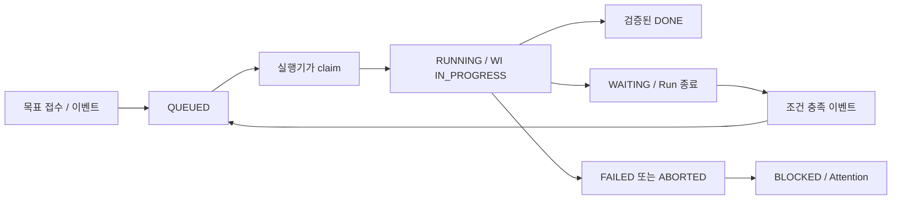

# 계획 저장과 Run 실행 연결

계산 결과를 불변 계획 버전으로 저장하고, Case·Work Item에 묶인 실행 권한으로 업무를 처리하는 서버 경로와 Node 실행기를 구현했다. 구매 제안·MANAGER 결정·발주 적용 REST 경로도 연결했다. 최소 Zig CLI와 Codex 컨테이너 이미지는 [CLI·런타임 안내](14_cli_and_runtime.md)를 따른다. 실제 Auth0/두 대화 클라이언트 로그인·모델 업무 수행과 대화 승인 도구 연결은 아직 남아 있다.

## 사용자 목표 접수

`POST /api/v1/cases`는 인증된 OPERATOR/MANAGER와 `Idempotency-Key`가 필요하다. 실제 요청자를 `opened_by_user_id`와 참여자에 기록하고 초기 Orchestrator Work Item과 QUEUED Run을 같은 트랜잭션으로 만든다. 초기 실행 예약 실패 시 접수 전체를 롤백한다.

선택 입력 `replenishment`는 `productSkus`, `warehouseId`, `targetDate`를 받는다. 창고를 생략하면 계획 정책이 등록된 창고가 정확히 하나일 때만 선택한다. SKU는 활성 완제품 ID로 해소하고 목표일은 최초 접수 시 고정한다. 상대적인 잔여 일수를 Case의 영구 목표로 저장하지 않는다.

동일한 키·입력은 원래 응답을 반환한다. 다른 입력에 같은 키를 사용하면 409다. 새 키라도 활성 계획 Case의 목표·창고·품목·마감일이 같으면 기존 Case에 연결하고 `reused=true`를 반환한다. 다른 목표는 기존 업무 검토가 필요하므로 409로 구분한다. 창고 연결은 계획 저장 경로와 공통 잠금을 사용한다.

MCP `create_case`는 키를 생성하거나 호출자가 준 `requestKey`를 유지하며, 실패 응답에도 유효한 키를 반환한다. 자동 재시도는 하지 않는다. 업무가 예약되었다는 사실과 실제 모델이 실행 중이라는 사실을 구분한다.

## 계획 버전 저장

| 경로 | 권한과 동작 |
|---|---|
| `POST /api/v1/cases/{caseRef}/plans` | 해당 Case/Work Item에 묶인 SUPPLY_CHAIN Run capability, 멱등 키 필수 |
| `GET /api/v1/plans/{planRef}` | 인간 ERP 조회 권한으로 저장된 계획·근거·hash 확인 |
| `GET /api/v1/agent/plans/{planRef}` | 유효한 Run capability의 같은 Case에 속한 계획만 조회 |

입력은 `warehouseId`, `productIds`, 선택적 `horizonDays`다. 기준일은 서버의 서울 시간대 `planningClock`에서 정한다. Case에 사람의 명시적 범위가 있으면 창고·제품 집합을 일치시켜야 하며, 생략한 예측 기간은 저장된 목표일까지의 잔여 일수로 계산한다. 에이전트가 명시한 기간이 마감일과 다르면 거부한다.

저장은 반복 읽기 트랜잭션에서 수행한다. 공통 계획 guard, 창고 조정 잠금 순서로 획득한 뒤 현재 lease·Case·Work Item·배정 역할을 검증하고 실제 ERP snapshot과 계산을 저장한다. 마지막 권한 검증에서 lease가 만료되면 계획·Attention·멱등 응답을 포함한 전체 변경을 롤백한다. 경합 재시도는 기존 트랜잭션 밖에서 새 snapshot으로 수행한다.

`replenishment_plans`에는 실제 source snapshot, 결과, 원본 업무, 버전, SHA-256을 저장한다. JSON 객체 키 순서와 소수 정밀도를 정규화하여 같은 데이터가 같은 hash를 갖도록 한다. 이전 계획의 수정·삭제·TRUNCATE는 허용하지 않는다.

정합성이 깨져 snapshot을 만들 수 없으면 가짜 계획을 저장하지 않고 Attention만 남기며 409를 반환한다. 유효한 snapshot에서 이력 부족 등 계산이 불가능하면 NEEDS_ATTENTION 계획으로 저장한다. 오류 응답의 재생도 중복 Attention을 만들지 않는다.

## 최신 계산 결과와 업무 완료

V22는 Work Item에 서버 소유 `planning_attempt_sequence`, `latest_planning_outcome`, `latest_planning_plan_id`를 추가한다. 새 계산 시도만 이 값을 갱신하며 과거 멱등 응답의 재생은 갱신하지 않는다. 계획 참조는 같은 Case와 원본 Work Item이어야 한다.

따라서 READY 버전 뒤에 계획을 만들지 못한 최신 실패가 있어도 예전 READY로 DONE을 선언할 수 없다. SUPPLY_CHAIN 완료는 최신 시도가 READY이고 같은 업무의 최신 계획을 가리킬 때만 가능하다. 에이전트가 전달한 metadata나 과거의 미검증 계획은 완료 근거로 사용하지 않는다.

Procurement 완료는 실제 발주와 불변 승인 내용을 비교하거나 서버가 구매 불필요를 검증한 경우에만 허용한다. QC 완료는 아직 허용하지 않는다. Orchestrator의 종료도 명시적 후속 책임 없이 허용하지 않으며, 어떤 Run 종료도 상위 품절 방지 Case를 자동 종결하지 않는다.

## 실행 권한과 수명주기

- 내부 `claim`, `heartbeat`, `finish`, `retry`는 허용된 Auth0 worker M2M 신원과 `worker:dispatch` 권한으로 제한한다.
- claim은 기존 대기·임대 만료를 재판정하고, 현재 담당과 Case 상태가 유효한 CODEX 작업을 가져온다. Work Item과 worker ID 각각에 활성 실행 하나만 허용한다.
- 실행기 lease token과 모델 capability token을 분리하며 DB에는 hash만 저장한다. 모델은 인간 토큰이나 M2M client secret을 받지 않는다.
- 모델 capability는 Case·Work Item·현재 배정·lease에 묶이고, 변경 트랜잭션 안에서 다시 잠금·검증한다. 인간 JWT를 agent 권한으로 대신 사용할 수 없다.
- `context_snapshot`은 예약 당시 기록으로 보존한다. claim 시 현재 Case와 관련 ERP 사실을 다시 구성해 별도 `execution_context`에 기록한다. 이전 계획 source snapshot은 덮어쓰지 않는다.
- heartbeat는 15초, lease는 60초, 실행 상한은 600초다. 임대 유실은 최대 한 번 새 Run으로 재예약한다. 반복 실패·기한 초과·명시적 실패는 BLOCKED와 Attention으로 남긴다.
- Work Item과 Run의 종료, 대기 저장, 후속 이벤트는 원자적으로 처리한다. CLI가 먼저 업무를 종료한 뒤 프로세스가 실패해도 원래 완료 receipt를 덮어쓰지 않는다.
- 일반 agent 대기 API는 DEPENDENCY_DONE과 SCHEDULED_TIME을 지원하며 최대 16개다. 충돌하는 alias와 잘못된 시각은 거부한다. APPROVAL 대기는 구매 제안 트랜잭션의 서버 전용 경로만 만들 수 있다.

## 구매 제안·결정·조회

| API | 책임 |
|---|---|
| `POST /api/v1/plans/{ref}/purchase-proposal` | 현재 Procurement capability와 멱등 키로 최신 계획을 재검증하고 불변 제안·Attention·승인 대기 저장. 본문은 `{}`이며 발주 행을 입력받지 않는다 |
| `GET /api/v1/approvals/{id}` | `erp:read`로 구매 내용·요청자·제안 역할·버전/hash·결정·생성 발주 ID 조회 |
| `POST /api/v1/approvals/{id}/decision` | 활성 MANAGER 및 `procurement:decide`. APPROVE/BLOCK, expectedVersion, proposalHash, reason과 멱등 키 필요 |
| `GET /api/v1/purchase-orders/{id}` | 실제 기본/구매 단위 수량·가격·납기와 계획·승인·적용 연결 조회 |

승인 전에는 발주가 없다. 승인과 발주·결정·적용·감사·이벤트가 함께 커밋되며 중간 실패는 전부 롤백한다. 동일 요청은 기존 결과를 재생한다. 변경된 입력은 원 제안을 EXPIRED로 기록한 뒤 409를 반환한다. 반려·만료가 같은 제안의 자동 재요청을 만들지 않는다. 이 REST 구현이 실제 대화 클라이언트에서 인간 확인을 받았다는 증거는 아니다.

계획 저장과 구매 판단은 `PlanningDataGuard`를 공유한다. 단순 행 잠금만으로는 대기 중인 REPEATABLE READ 트랜잭션의 snapshot이 갱신되지 않으므로 guard의 revision도 증가시킨다. 앞선 계획 저장을 기다렸던 요청은 SQLSTATE 40001에서 전체 트랜잭션을 다시 시작하고 새 계획 버전을 확인한다. 이 revision은 조정용 값이며 업무 수량이나 계획 내용은 아니다.

제안의 `executionResult`는 서버가 이미 저장한 상태다. 승인 대기는 `outcome=WAITING`, 빈 `waitingConditions`, `resultRef=APPROVAL-<id>`로 표현한다. 실행기는 원래 terminal receipt를 확인하며, 아직 실행 중인 Run에 이런 참조만 보내도 서버가 새 대기를 허용하지 않는다.

## 데이터 접근과 코드 생성

구매 모듈은 제안·결정·검증 서비스와 데이터 접근을 분리했다. 쿼리는 jOOQ 3.21.7의 생성된 테이블·컬럼·enum으로 작성하며 JPA는 사용하지 않는다. 값은 DSL에 전달해 바인딩하고, 요청 값을 SQL 문자열에 이어 붙이지 않는다. 나머지 기존 JDBC 경로는 아직 점진적 전환 대상이다.

기존 `InterfaceService`도 접수와 조회로 분리했다. `CaseIntakeService`는 인간 권한·목표 범위·기존 Case 재사용·초기 실행 예약을 담당하고, `CaseIntakeRepository`가 해당 저장과 잠금을 수행한다. `InterfaceQueries`는 조회 응답·반환 개수 정책, `InterfaceReadRepository`는 생성된 타입을 사용한 조회만 담당한다. Run 예약은 기존 `RunService`로 직접 연결한다. API의 재고 검색·Case 접수·모니터 의미를 바꾸지 않는 정리이며, Dispatcher와 실행 컨텍스트 등의 기존 JDBC 구현은 남아 있다.

외부 신원 조회와 멱등 응답 저장도 생성된 타입을 사용한다. 신원은 여전히 매 요청 `(issuer, subject)`와 활성 ERP 사용자를 조회하며 캐시로 역할 변경을 늦추지 않는다. 멱등 키의 advisory lock과 응답 저장은 호출자의 기존 트랜잭션에 참여하고, 충돌·롤백·재생 규칙을 유지한다.

Run 임대의 조회·잠금은 `RunLeaseRepository`가 생성된 타입으로 수행한다. capability 인증은 저장소 조회 뒤 현재 배정·Case·역할·만료를 판정한다. Work Item → Run → Case → Agent 잠금 순서, DB 시계 기준 lease/600초 제한과 종료 후 권한 폐기는 유지한다.

`backend`에서 `./gradlew generateJooq`를 실행하면 Testcontainers가 임시 PostgreSQL 18.6을 시작하고 Flyway 전체 마이그레이션을 적용한 뒤 Java 타입을 만든다. Docker가 필요하며 실제 애플리케이션 DB 설정이나 자격증명을 사용하지 않는다. 생성 코드는 `build/generated/sources/jooq`에만 있고 커밋하지 않는다. `compileJava`가 이 작업에 의존하며, 마이그레이션·생성기 변경 시 다시 생성한다. 변경이 없으면 Gradle의 최신 상태 검사를 사용한다.

Spring이 제공하는 DSLContext로 기존 JDBC 트랜잭션에 참여한다. 쿼리의 스키마는 연결의 search_path를 따르므로 테스트 전용 스키마도 격리된다. 타입 생성은 컬럼·값의 타입 오류를 더 일찍 드러내며, 업무 조건과 동시성의 정확성은 별도 통합 테스트로 검증한다. [jOOQ 코드 생성](https://www.jooq.org/doc/latest/manual/code-generation/)과 [Spring 통합](https://docs.spring.io/spring-boot/reference/data/sql.html)을 따른다.

claim은 비밀값을 한 번 발급하는 제어 프로토콜이므로 원래 토큰 응답을 저장·재생하지 않는다. 같은 worker에 활성 lease가 있으면 409로 거부한다. 응답 유실 시 실행기는 즉시 다른 작업을 가져가지 않고 최대 60초 기다린다. 일반 업무 쓰기의 멱등 처리와 이 발급 예외를 구분한다. 기존 수동 dispatch는 호출 사실을 기록하는 관리 트리거이며 Event 인입은 별도의 외부 이벤트 키를 사용한다.

## Node 실행기

[실행기 README](../agents/runner/README.md)의 환경 설정과 이미지 계약을 따른다. 코디네이터는 Auth0 M2M 토큰을 유지하고 한 번에 하나의 작업을 실행한다. Docker 자식에는 scoped capability와 CLI용 `MULINO_API_URL`만 전달하며, 사용자 홈이나 Docker socket을 마운트하지 않는다. 전용 Codex 로그인 볼륨과 읽기 전용 이미지·임시 작업 디렉터리를 사용한다.

모델의 잘못된 결과나 서버의 완료 검증 거부는 lease를 확인한 후 새 요청 키로 FAILED 전환을 한 번 시도한다. stale lease에는 추가 쓰기를 하지 않고, 이미 확정된 결과가 있으면 그것을 유지한다. 출력 크기를 제한하고 토큰·시크릿을 가린다.

자동 시험은 실제 Node 자식 프로세스와 모의 Auth0/백엔드를 사용한다. 추가로 고정 Codex 버전의 실제 Docker 이미지에서 Linux CLI·권한·파일 제한·취소를 시험했으며 모델 호출은 수행하지 않았다. 역할 지침과 실제 claim 맥락의 크기·숫자 정밀도는 [CLI·런타임 안내](14_cli_and_runtime.md)를 따른다.

## 검증과 마이그레이션

- PostgreSQL 18의 전체 Backend `clean test bootJar`: 457개 통과, 실패·오류·skip 0. 역할별 Case 참여자·예약 맥락 저장과 JSONB 맥락의 큰 ID·고정밀 소수 보존 회귀를 포함한다.
- Node 실행기 48개, MCP 19개 테스트 통과. 실행기의 업무 수량·큰 정수 전달 정밀도와 고정 역할·설정도 포함한다.
- V20은 QUEUED enum을 먼저 추가하고 V21에서 lease·멱등 데이터와 인덱스를 사용한다. V22는 최신 계산 결과의 원본 업무 연결을 강제한다.
- 기존 RUNNING 예약 기록은 ABORTED로 정리하고 원래 snapshot을 보존한다. 이미 종료되었거나 실제 대기 중인 의무를 강제로 깨우지 않는다.
- 독립 DDL 00~15·seed와 Flyway 경로를 별도 PostgreSQL 18 DB에서 검증했다. 외부 Auth0/ChatGPT/Codex 로그인, 실제 모델 실행, 대화 승인 연결과 전체 시연 인수는 아직 남아 있다.
